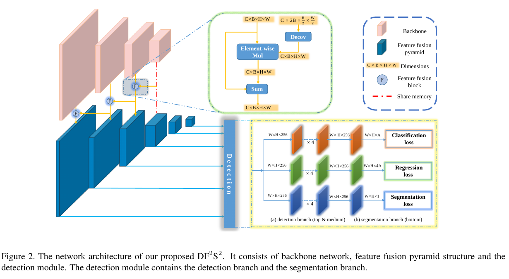
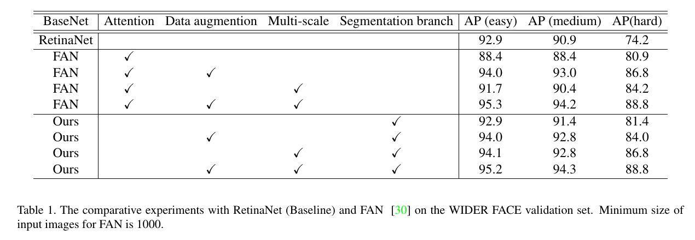
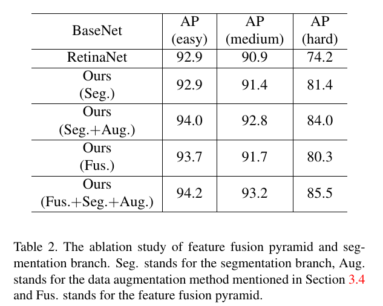
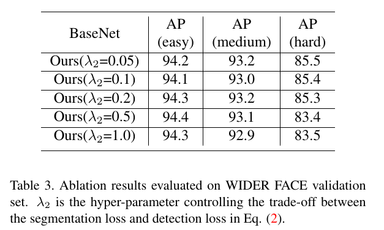
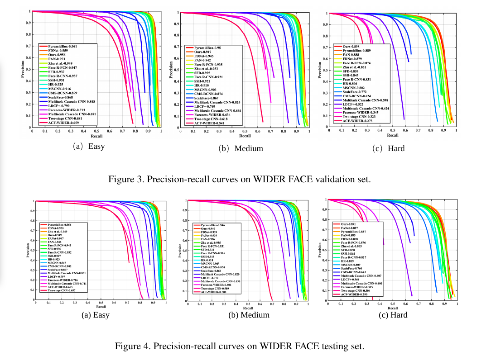
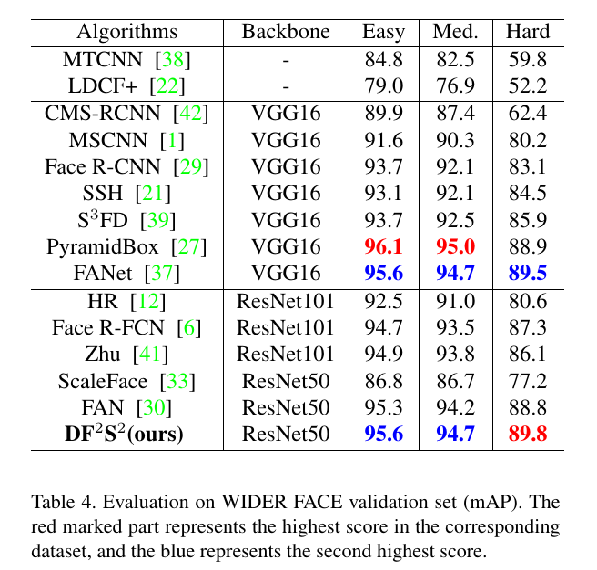

Learning Better Features for Face Detection with Feature Fusion and Segmentation Supervision
=

# 1. Introduction
人脸检测是人脸后续人脸相关应用（例如人脸对齐、人脸识别和人脸验证等）的关键步骤。在过去几十年获得到很好的发展。继Viola-Jones人脸检测器的开创性工作之后，大多数早期工作都集中在手工制作有效特征和训练强大的分类器。但是这些手工制作的特征是不加区别的，每个组件都是隔离的，使得人脸检测管道不是最佳的。

最近，对象检测借用ImageNet [14]预训练模型作为图像分类的主干，并获得了显着的改进。因为图像分类任务仅需要语义来识别类别，所以在更深的CNN中特征图拥有更多的语义信息和更少的细节信息，然而，语义和细节都需要人脸检测器来检测具有各种尺度和特征的不同位置的面部。因此，FPN [15]提出了一种分而治之的原则，即不同尺度的对象被收集并分发到不同的特征层，附加自上而下的结构以保持高空间分辨率和语义信息。因此，特征融合的关键是阻止不同特征图之间的冲突和转换过程中的信息损失。为了在低级层获得丰富的语义信息，并防止细节被过多的语义覆盖，我们提出一种新颖的特征金字塔结构以空间和逐通道注意力来融合形式更高级的特征图和更低级的特征图。更具体地，我们将更高级的特征图作为线索来以逐通道地乘以更低级的特征图。我们通过应用转置卷积（也称为deconvolution）来进一步避免语义信息的丢失。

其次，大多数工作将检测任务划分为分类任务和回归任务，两者都需要预设的锚。当锚与对象匹配不佳时，浪费检测监督信息会忽略这些对象，使得优化不是最理想的。因此，锚定分配策略决定了基于锚点的人脸检测的性能上限。

本文中，为了补充锚定分配策略并最好地利用检测监督信息，我们引入了一个有效的分割分支，如[18]。以分层方式利用边界框分割group-truth训练分割分支。分割分支以自监督的形式帮助网络学习对象区域可辨别的特征，这在[25]中被证明是有帮助的。我们在训练阶段采用分割来应用注意力机制——一种结合上下文内容的动态特征提取器，因为CNN特征本质上是空间的、逐通道和多层的，并且在推理阶段没有额外的参数。我们在WIDER FACE [32]基准测试中进行了大量实验，以验证我们提出的结构的有效性。

总之，本文的主要贡献如下：
1. 我们提出了一种新颖的特征金字塔结构，将语义信息应用于更高级别的特征图为上下文线索，从而以空间和逐通道的注意力方式增强低级特征映射中的语义。
2. 我们通过弥补具有语义分割分支的锚机制来改进典型的深单发检测器，以应用注意机制，而不会影响推理速度。
3. 我们提出一种新颖的单发人脸检测器，称为 $DF^2S^2$ （Detection with Feature Fusion and Segmentation Supervision），其能够为人脸检测学习更好的特征，并因此能够良好地处理遮挡和多尺度问题。
4. 在WIDER FACE数据集上进行了大量实验，以证明我们模型的效率和有效性。
5. 我们使用实时推理速度在WIDER FACE数据集上实现最先进的结果。

# 2. Related Work

# 3. Detection with Feature Fusion and Segmentation Supervision($DF^2S^2$)

本节中，我们介绍用于人脸检测的 $DF^2S^2$ 框架。首先，我们在3.1节中介绍综合结构。然后，我们在3.2中提出一种新颖的特征融合金字塔结构来替换FPN，并在3.3节中，介绍在所有级别的特征图中用于平衡语义和细节的分割分支。最后，我们在3.4节中介绍相关的训练方法。

## 3.1 Overall architecture
我们的目标是在所有层上学习更多辨别性的具有丰富语义和细节的层级特征以检测困难人脸，如小型人脸、部分遮挡人脸等。图2说明了我们提出的具有特征融合金字塔和分段分支的网络。为了获得强大的通用性，我们将广泛采用的ResNet-50作为骨干CNN架构，并模拟 $S^3FD$ 来构建我们的单发多尺度人脸检测器。

首先，我们基于来自ResNet-50的四层 $\{res2/_2，res3/_3，res4/_5，res5/_2\}$ 构建我们的特征融合金字塔结构（图2的左上部分为白色）。该结构采用来自这些层的四个特征图作为输入，并生成四个相应的新特征图，其中增加了语义和 $\{FFP_2，FFP_3，FFP_4，FFP_5\}$ 的细节（图2中左下角突出显示为蓝色特征图） ，其空间分辨率和通道数分别与输入特征图相同。为了获得更大的感受野以检测更大的人脸，我们只是连续两次最大化 $FFP_5$ 特征图，以获得 $\{FFP_6，FFP_7\}$ 的额外两个特征图。6个检测特征图的步长分别为 $\{4,8,16,32,64,128\}$ 。如图2所示，检测和分割在 $FFP_n$ 的特征图（范围从2到7）上执行。

在检测分支中，分类子网络使用4个 $3 \times 3$ 的卷积层，每个卷积层有256个滤波器，接着是具有 $K \times A$ 个滤波器的 $3 \times 3$ 卷积层，其中 $K$ 表示每个位置类的数量，$A$ 表示每个位置锚的数量。对于人脸检测，由于我们使用sigmoid激活，所以 $K = 1$ ，兵器在多数实验中我们使用 $A = 6$ 。该子网络中的所有卷积层在所有金字塔层共享参数，以加速参数收敛。回归分支与分类分支相同，除了它以具有线性激活的 $4 \times A$ 卷积滤波器结束。

为了加强分类子网和回归子网之间的关联以及改善语义监督信息和位置监督信息的分离，卷积层的参数实现跨越检测分支的共享，除了最后的预测层。

## 3.2 Segmentation branch
为了弥补锚定配策略并充分利用检测监督信息，我们提出了有效和高效的分割分支。如图2右下部所示，分割分支与头部架构中的分类子网和回归子网并行。它采用 $FFP_2, FFP_3, FFP_4, FFP_5,FFP_6,FFP_7$ 的特征图作为输入，这与检测分支相同，并且以层级的形式使用边界框级分割ground-truth监督。遵循[19]和$S^3FD$的配对准则，这些层级的分割图与匹配它们相应感受野的ground-truth人脸关联。分割分支和检测分支之间的感受野是相同的，从而使它们关注相同范围的人脸尺度。因此，我们的分割帮助网络学习人脸区域中的更具辨别性的特征，并且进一步使得检测分支中的分类和回归更加容易，促进更好的优化。

我们在输入特征图之后，添加四个 $3 \times 3$ 卷积层，每个卷积层有256个滤波器，接着是一个具有 $K$ 个滤波器的 $3 \times 3$ 卷积层，其中 $K$ 表示类的数量。对于人脸检测，由于我们使用sigmoid激活，所以 $K = 1$ 。为了加强分割监督信息对检测分支的影响，并保留分割分支中更多的参数，前面四个卷积层的参数与检测分支共享。对于分割预测图的无用性，在推断时间中不推荐使用分割分支。

我们优于分割分支的其他用途的是，与其应用分割预测图（如FAN [30]）或中间结果（如DES [40]）来激活主分支的特征图，我们以自监督的方式应用注意力机制，而没有额外参数和激活操作。此外，人脸检测的边界框分割ground-truth中几乎没有多余的背景区域，因为当混沌背景干扰对象区域的判别特征的学习时，人脸区域通常占据边界框地面实例的大部分位置。数学上，人脸实际分割ground-truth和边界框ground-truth之间的IoU很高，使得冗余的背景区域的影响可以忽略。

## 3.3. Feature fusion pyramids
图2展示了所提出的特征融合金字塔和特征融合块（简称“F-block”）的思想。我们采用“F-block”自上而下递归地融合不同特征图。数学上，我们将特征融合表示为 $\phi_i = F(\phi_{i+1},\phi_i;\theta)$ ，并描述我们的 $F$ 为如下公式：

$$\phi_i = \phi_i \dot \Psi(\phi_{i+1}; \theta) + \phi_i  \tag 1$$

其中 $\phi_i$ 和 $\phi_{i+1}$ 分别表示浅层特征图和深层特征图。 $\Psi$ 表示高级特征图上的转置卷积，$\theta$ 表示转置卷积测参数。公式左边的 $\phi_i$ 表示融合后生成的新特征图，并将继续参与更底层的特征图直到最底层。这种逐元素乘法（表示为 $\cdot$）可以看做空间和逐通道注意力的组合，其最大化了底层和高层表示之间的互信息。此外，为了加强细节信息，其对检测困难人脸至关重要，然后，在逐元素乘法之后，将低级特征图添加到先前生成的特征图。

值得注意的是，在转换到更高级别的特征图时，我们应用转置卷积而不是上采样操作和一个卷积的组合。一方面，如果我首先上采样高级特征图，它将使后续卷积操作的参数数量加倍，这将损害推理速度。另一方面，如果我们首先将高级特征图卷积到通道数量的一半，我们可能会不可避免地丢失一些高级特征映射的语义，从而损害了特征的融合。因此，我们利用转置卷积，一步完成空间分辨率和特征图通道的改变。

## 3.4 Training
本节中，我们介绍锚分配策略、损失函数、数据增强和其他实现细节。

**Anchor assign strategy.** 按照 $S^3FD$ 中锚的尺度设计，我们有6个检测器层，每层关联一个特定尺度的锚。具体而言，锚尺度根据有效感受野精心设计，使得锚的尺寸是每层不成的4倍。因此，我们在金字塔级上从 $16^2$ 到 $512^2$ 设置锚。此外，锚的纵横比设置为 1 和 1.5 ，因为多数正面人脸近似正方形，而侧脸可以视为 $1:1.5$ 的矩形。具体而言，给IoU大于0.5的锚分配ground-truth框，而如果IoU小于0.5则分配为背景。没有分配的锚在训练期间被忽略。

**Loss function.** 在训练阶段，添加一个额外的用于分割分支的交叉熵损失函数到结合的原始人脸检测损失函数以联合优化模型参数：

$$
\begin{alignat}{2}
L = & \sum_k \frac{1}{N_k^c} \sum_{i \in A_k} L_c(p_i, p_i^\ast) + \\
& \lambda_1 \sum_k \frac{1}{N_k^r} \sum_{i\in A_k}I(p_i^\ast)L_r(t_i, t_i^\ast) + \\
& \lambda_2 \sum_k L_s(m_k, m_k^\ast)
\end{alignat}
$$

其中 $k$ 是特征融合金字塔层的索引 （$k \in [2, 7]$） ，而 $A_k$ 表示定义在金字塔级 $P_k$ 上的锚的集合。如果锚为正，ground-truth标签 $p_i\ast$ 为 1 ，否则为 0 。$p_i$ 为我们的模型的预测结果。$t_i$ 为表示预测边界框的4个参数化坐标的向量，而 $t_i^\ast$ 为正类锚关联的边界框。

分类损失为两个类（人脸和背景）上的focal loss。$N_k^c$ 为 $P_k$ 中锚的数量，其参与分类损失计算。回归损失 $L_r(t_i,t_i^\ast)$ 为 smooth $L_1$ 损失。 $I(p_i^\ast)$ 为限制回归损失仅关注正分配锚的指示函数，而 $N_k^r = \sum_{i \in A_k}I(p_i^\ast)$ 。分割损失 $L_s(m_i, m_i^\ast)$ 为逐像素的sigmoid交叉熵。 $m_k$ 为每个级别生成的分割预测图，$m_i^\ast$ 为3.2节中描述的弱监督分割 ground-truth， $\lambda_1$ 和 $\lambda_2$ 用于平衡这些损失项，这里我们仅设置 $\lambda_1 = 1$ ，并在4.3节中更多地讨论 $\lambda_2$ 。

**Data augmentation.** 根据WiderFace数据集的统计，大约有 26% 的人脸是遮挡的。在它们之中，大约16%的人脸是严重遮挡的。由于我们的目标是解决被遮挡的人脸，因此被遮挡的人脸的训练样本可能不足。因此，我们采用随机裁剪数据增强。这样的性能改善是明显的。除了遮盖面部的好处之外，我们的随机裁剪增强可能会提高小脸的表现，因为增大后会有更多的小脸扩大。

**Other implementation details.** 训练从使用动量为 0.9、权重衰减为 0.0001 、批量大小为32以及4个GPU上采用SGD来微调ResNet-50骨干网络开始。新添加的层使用Xavier初始化。训练模型120个epoch，在前80个epoch中学习率为 $4 \times 10^{-3}$，使用 $4 \times 10^{-4}$ 和 $4 \times 10^{-5}$ 各训练20个epoch 。我们基于 Detectron 实现，并我们的源码是公开可用的。

# 4. Experiments
**Datasets.** 我们在WIDER FACE数据集上执行模型分析，40%用于训练、10%用于验证、50%用于测试。训练和验证集的标注是在线可用的。根据检测任务，它有三种划分：Easy、Medium和Hard。评估度量为IoU为0.5的mean average precision（mAP）。我们在 WIDER FACE上训练我们的模型，并在验证和测试集上评估。如果不同特别说明，表1、 2、 3的结果是将短边调整到800同时保持纵横比不变，而获得的单尺度测试结果。
 
**Baseline.** 为了评估我们的贡献，我们使用我们的基线进行比较实验。我们采用紧密相关的检测器RetinaNet作为基线。我们采用3.4节中提到的策略来训练所有模型，以进行公平比较。

## 4.1. Ablation studies on segmentation branch

## 4.2. Ablation studies on feature fusion

## 4.3. Experiments on Balancing the loss

## 4.4. Evaluation on WIDER FACE benchmark

