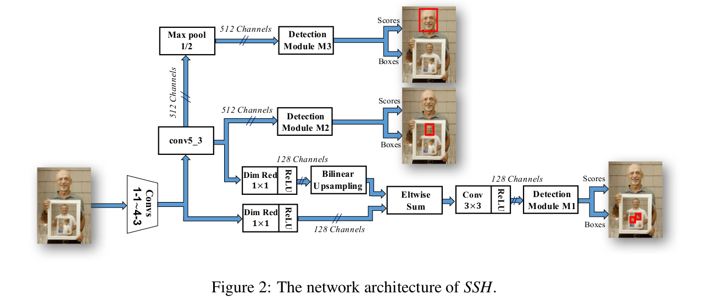
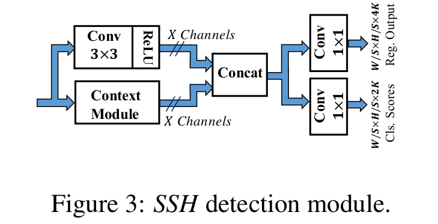
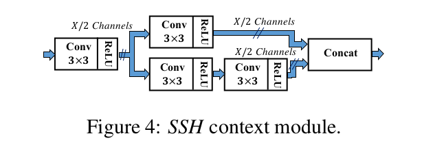
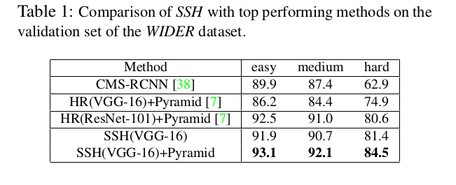

SSH: Single Stage Headless Face Detector
=

# 1 Introduction
在两阶段检测器中的第二阶段称为“head”，其用于提取候选的特征，并分类它们。分类网络的头部计算量非常大，而且所有的候选边界框都需执行头部计算。

《Finding tiny faces》使用与RPN的方法直接检测人脸。其通过将图像金字塔集成为该方法的一部分来获得输入尺度的鲁棒性。然而，它涉及处理一个输入金字塔，其上采样尺度高达每边5000像素，并将每个级别传递到一个非常深的网络，这增加了推理时间。

# 3 Proposed Method
SSH设计用于减少推理时间，具有较低的内存占用量，并且具有尺度不变性。
## 3.1 General Architecture

图2为SSH的架构。它是一个全卷积网络，它通过在歩幅为8、 16和32的特征图上添加一个检测模块来定位和分类人脸，并称之为 $\cal{M}_1, \cal{M}_2$ 和 $\cal{M}_3$ 。检测模块包含用于检测和定位人脸的卷积二值分类器和回归器。

对于定位子问题，SSH将一组称为anchor的预定义边界框回归到ground-truth人脸。在每个滑动窗口的位置，定义具有相同中心、不同尺度的 $K$ 个anchor 。但是，与RPN不同，我们只考虑纵横比为1的锚来减少锚框的数量。 在实验中注意到，具有各种纵横比对面部检测精度没有明显影响。_更正式地，如果与检测模块 $M_i$ 对应的特征图的大小为 $W_i \times H_i$_ ，那么有纵横比为1、尺度为 $\{S_i^1, S_i^2, \cdots, S_i^{K_i}\}$ 的anchor共 $W_i \times H_i \times K_i$ 个。

图3为检测模块，它包一个简单的上下文模块（context module）来增加感受野。在 $\cal{M}_1$ 中，上下文模块的输出通道数（即图3和图4的“X”）为128 ，在 $\cal{M}_2$ 和 $\cal{M}_3$ 中， X为256 。最后，两个卷积用于执行边界框回归和分类。在 $\cal{M}_i$ 中的每个卷积位置处，分类器确定滤波器中心处的窗口是否包含对应于每个尺度 $\{S_i^k\}_{k=1}^K$ 的面部。 $2 \times K$ 个输出通道的 $1 \times 1$ 卷积层用于分类器， $4 \times K$ 个输出通道的 $1 \times 1$ 卷积层用于回归器。在卷积期间的每个位置处，回归量预测所需的尺度和平移变化以使每个正锚与面相匹配。

## 3.2 Scale-Invariance Design
在不受约束的设置中，图像中的人脸具有不同的尺度。《Finding tiny faces》将输入调整到不同尺度的输入金字塔，但这种方法很慢。相比之下，SSH使用一个前馈传递，同时检测大脸和小脸。受FPN的启发，使用检测模块 $\cal{M}_1, \cal{M}_2$ 和 $\cal{M}_3$ 检测来自网络的三个不同卷积层的人脸。这些模块的歩幅为 8、 16 和 32 ，并且分表检测小、中、大人脸。

更确切地说，检测模块 $\cal{M}_2$在VGG-16的conv5-3层执行检测。尽管可以将检测模块M1直接放置在conv4-3的顶部，但使用先前为语义分割[17]和通用对象检测（FPN）[14]部署的特征图融合。然而为了减少模型的内存消耗，使用 $1 \times 1$ 卷积将特征图的通道数从512减少到128 。conv5-3的特征图被上采样并加到conv4-3的特征，接着是 $3 \times  3$ 卷积层。在融合过程中，本文使用双线性采样。为了检测更大的人脸，在conv5-3层之上添加一个步长为2的max-pooling以将步长增加到32 。检测模块 $\cal{M}_3$ 置于新添加的层之上。

在训练期间，每个检测模块 $\cal{M}_i$ 从一个目标尺度范围检测人脸。

## 3.3 Context Module

在两阶段方法中，通常扩大候选提议周围的窗口来处理上下文。SSH使用简单的卷积层来模仿这种策略。图4为集成到检测模块的上下文层。由于锚以卷积方式被分类和回归，因此应用更大的滤波器类似于增加两级检测器中的提议的窗口大小。所以在上下文模块中使用 $5 \times 5$ 和 $7 \times 7$ 滤波器。以这种方式对上下文建模增加了与相应层的步幅成比例的感受野，并且因此增加了每个检测模块的目标尺度。为了减少参数量，使用连续的 $3 \times 3$ 滤波器替换更大的卷积滤波器。在 $\cal{M}_1$ 中，上下文模块的输出通道数（即图3和图4的“X”）为128 ，在 $\cal{M}_2$ 和 $\cal{M}_3$ 中， X为256 。

## 3.4 Training
使用带动量的随机梯度和权重衰减训练网络。为了对特定范围的尺度的三个检测模块中的每一个进行专门化，仅反向传播分配给相应范围中的人脸的锚的损失。当且仅当IoU大于0.5，anchor分配给ground-truth人脸。因此，对于与模块的锚尺寸不一致的ground-truth人脸，不会通过网络反向传播损失。

### 3.4.1 Loss function
损失函数为
$$
\begin{alignat}{0}
\sum_k \frac{1}{N_k^c} \sum_{i \in \cal{A}_k} l_c(p_i, g_i) +  \\
\lambda \sum_k \frac{1}{N_k^r} \sum_{i \in \cal{A}_k} \cal{I}(g_i = 1) l_r(b_i, t_i) \tag 1
\end{alignat}
$$
其中 $l_c$ 是人脸分类损失，使用标准的softmax loss 。索引 $k$ 遍历SSH检测模块 $\cal{M} = {\cal{\{M_k\}}}_1^K$ ，A表示 $\cal{M}$ 中定义的锚集。回归使用smooth L1损失。

## 3.5 Online hard negative and positive mining
OHEM独立地应用于每个检测模块（ $\cal{M}_k$ ），即，对于每个检测模块 $\cal{M}_k$ ，在每个次迭代中，选择对应于网络权重的具有最高得分的负anchor和最低得分的正anchor组成mini-batch 。同时，由于负anchor的数量远大于正类，因此选择正负之比为 $1:3$ 。

# 4 Experiments
## 4.1 Experimental Setup
在4个GPU上并行地使用SGD，mini-batch = 4 。从预训练的ImageNet分类网络微调21K次迭代。固定学习率到conv3-1 。初始学习率设置为0.004，并在18K迭代后减小10倍。momentum=0.9，weight decay = $5e^{-4}$ 。IoU > 0.5 的anchor设置为正类，IoU < 0.3 的anchor设置为背景类。 $\cal{M}_1$ 的尺度为 $\{1, 2\}$ ， $\cal{M}_2$ 的尺度为 $\{4, 8\}$ ， $\cal{M}_3$ 的尺度为 $\{16, 32\}$ ，其中基本anchor的大小为16个像素。纵横比全为1 。在训练期间，每幅图像的每个检测模块选择256个检测。在推理期间，每个模块输出1000个最佳得分的anchor作为检测，然后使用阈值为0.3的NMS抑制重复框。

## 4.2 Datasets
WIDER FDDB Pascal Faces

## 4.3 WIDER Dataset Result
在报告没有图像金字塔的SSH时，将图像的最短边重新缩放到1200像素，同时保持最大边低于1600像素而不改变宽高比。当使用SSH+pyramid时，首先将最短边调整到800像素，最长边调整到1200像素，然后将图像调整到具有最小尺寸为500，800，1200和1600，所有的模块在所有金字塔级别上检测人脸，除了 $\cal{M}_3$ 不使用最大的级别。表1为SSH在WINDER验证集上的比较。图5为简单、适中和较难三中人脸上的预测召回率曲线。

## 4.4 FDDB and Pascal Faces Results
图6为FDDB和Pascal-Face数据上的检测结果。

## 4.5 Timing
表2为不同输入的推理时间。

