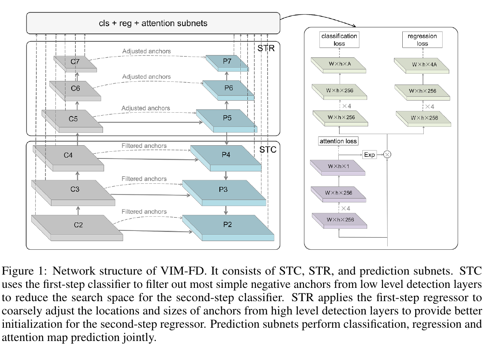
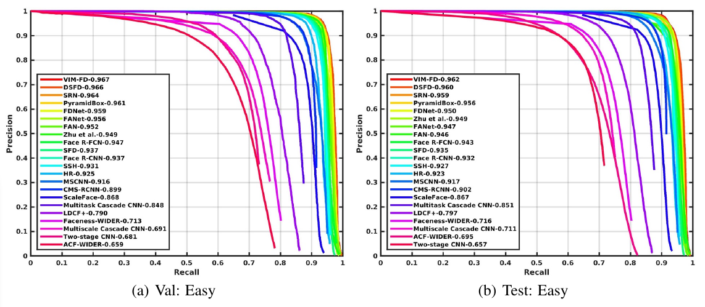
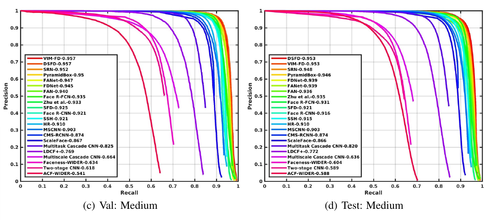
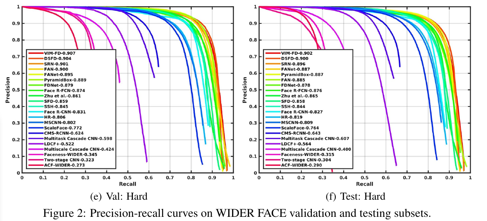

Robust and High Performance Face Detector
=

# 1. Introduction
本文中，我们重新实现了历史最佳检测器[1]（SRN），并将它用作我们的基线模型。然后，我们从如下几个方面回顾几种提出的技巧：（1）数据增强方法；（2）匹配和分类策略；（3）骨干网络的影响；（4）人脸检测中的注意力机制。通过这些技巧的有机整合，我们获得了一个非常强大的人脸检测器，它在WIDER FACE数据集上实现了最先进的结果。

# 3. Proposed Approach
VIM-FD的总体框架如图1所示，我们将每个组件描述如下。

## 3.1 Backbone
原始检测器SRN采用ResNet-50作为器骨干网络，目前有点过时了。我们利用几种更有力的骨干网络，如ResNeXt、DenseNet和NASNet。最后，我们采用具有6个级别的特征金字塔结构的DenseNet-121作为VIM-FD的骨干网络。从DenseNet-121的四个块提取的特征图表示为 C2、C3、C4和C5 。在C5之后，C6和C7仅由两个简单的下采样 $3 \times 3$ 卷积层提取。bottom-up和top-down路径的侧连接于[14]（FPN）相同。P2、P3、P4和P5由侧连接提取的特征图，分别与C2、C3、C4和C5对应，并有相同的空间尺寸，而P6和P7仅在P5之后通过$3 \times 3$卷积层下采样得到。

## 3.2 STC and STR Module
STC模块旨在从低级检测层过滤多数负锚以减小后续分类器的搜索空间，其选择C2、C3、C4、P2、P3和P4执行两步回归。而STR模块设计用于粗超调整高级检测层的锚的位置和尺寸以为后续的回归器提供更好的初始化，其选择C5、C6、C7、P5、P6和P7执行两步回归。这两个模块的损失函数也与SRN相同：

$$
\begin{alignat}{2}
L_{STC}(\{p_i\}, \{q_i\}) &= \frac{1}{N_{s_1}} \sum_{i\in\Omega} L_{FL}(p_i, l_i^\ast) \\
& + \frac{1}{N_{s_2}}\sum_{i \in \Phi}L_{FL}(q_i, l_i^\ast)
\end{alignat} \tag 1
$$

其中 $i$ 是mini-batch中锚的索引，$p_i$ 和 $q_i$ 在第一和第二步中是锚 $i$ 为人脸的预测置信度，$l_i^\ast$ 为锚 $i$ 个ground-truth类标签， $N_{s_1}$ 和 $N_{s_2}$ 为第一和第二步中的正类锚的数量，$\Omega$ 表示两步分类采样的样本集合，$\Phi$ 表示第一步过滤后余下的样本集。二值分类损失 $L_{FL}$ 是两类（人脸 vs. 背景）上sigmoid focal loss 。

$$
\begin{alignat}{2}
L_{STR}(\{x_i\}, \{t_i\}) &= \sum_{i\in\Psi}[l_i^\ast=1]L_r(x_i, g_i^\ast) \\
&+\sum_{i\in\Phi}[l_i^\ast=1]L_r(t_i, g_i^\ast)
\end{alignat} \tag 2
$$

其中 $g_i^\ast$ 是锚 $i$ 的ground-truth位置和大小，$x_i$是第一步中锚 $i$ 精炼的坐标，$t_i$是第二步中边界框的坐标，$\Psi$ 表示两步回归选择的样本集合，$l_i^\ast$ 和 $\Phi$ 与STC定义的相同。与Faster R-CNN相似，我们使用smooth $L_1$ 损失作为回归损失 $L_r$ 。当条件为真（即 $l_i^\ast = 1$， 该锚不是负类）时，方括号指示函数 $[l_i^\ast=1]$ ，否则输出 0 。因此， $[l_i^\ast=1]L_r$ 表示负锚忽略回归损失。

## 3.3 Attention module
目前，对象检测和人脸检测不断使用注意力机制。DES[6]使用弱监督语义分割的思想，以提供提供高语义意义和类感知特征，以激活和校准在对象检测中使用的特征图。FAN [5]引入了锚点级别的注意力，突出了面部区域的特征，并成功地减轻了false positive的风险。

我们将FAN中的注意子网应用于P2，P3，P4，P5，P6和P7层，其具体结构如图1所示。具体而言，注意力监督信息通过填充ground-truth边界框获得。并且监督的掩模与分配给当前检测层中的锚点的ground-truth人脸相关联。因为第一步和第二步共享相同的子网络，我们还将注意力子网络用于bottom-up层，但是我们没有计算这些层的注意力损失。我们定义注意力损失函数为：

$$L_{ATT}(\{m_i\}) = \sum_{i \in X} L_{sig}(m_i, m_i^\ast) \tag 3$$

其中 $m_i$ 为第二步中每层生成的预测注意力图，$m_i^\ast$为第 $i$ 个检测层的ground-truth注意力掩膜，$X$ 表示应用注意力机制的检测层的集合（即P2、P3、P4、P5、P6和P7）， $L_{sig}$ 为逐像素的sigmoid交叉熵损失。

## 3.4 Max-in-out Label
$S^3FD$ 引入max-out背景标签以减小小型负样本的false positive。PyramidBox在正负样本上都使用这种策略。具体而言，这种策略首先在每个预测模块中预测 $c_p + c_n$ 个得分，然后选择 最大的 $c_p$ 作为正类得分。相似地，它最大的 $c_n$ 得分作为负类得分。在我们的VIM-FD中，我们在分类子网络中采用max-in-out标签，并设置  $c_p = 3$ 、$c_n=3$ 以召回更多人脸以及减小false positive。

## 3.5 Anchor Design and Matching
锚的尺度和纵横比设计与SRN相同。在每个金字塔级别，我们使用与SRN相同的两种特定尺度（即 $2S$ 和 $2 \sqrt{2} S$ ，其中 $S$ 表示每个金字塔级别的总步长）和一种纵横比（即1.25）。总之，每个级别有 $A=2$ 个锚，它们覆盖了相对于网络输入图像的级别8到362像素的尺度范围。

在训练阶段，锚需要划分为正类和负类样本。具体而言，使用 $\theta_p$ 的交叉联合（IoU）阈值将锚分配给ground-truth框。 如果他们的IoU在 $[0，\theta_n]$ ，则为背景。如果锚未被分配，这可能是其重叠位于 $[\theta_n，\theta_p]$ 中，则在训练期间忽略它。根据经验，我们为第一步设置 $\theta_n= 0.3$ 和 $\theta_p= 0.7$，对于第二步设置 $\theta_n=\theta_p= 0.35$ 。该设置借鉴了 $S^3FD$ 中的尺度补偿锚匹配策略[4]，旨在提高小型人脸的召回率。该设置基于观察，其尺度远离锚尺度的人脸不能匹配足够的锚。为解决此问题，我们降低IoU阈值以增加匹配锚点的平均数量。尺度补偿锚匹配策略大大增加了微小外表面的匹配锚点，显着提高了这些面的召回率。

## 3.6 Data Augmentation
我们采用 PyramidBox中的data-ancho-sampling以多样化训练样本的分布和构建一个鲁棒性模型。具体而言，我们首先在一个batch中随机选择大小为 $S_{face}$ 的人脸。令

$$i_{anchor} = \arg \min_i abs(S_{anchor_i} - S_{face} )\tag 4$$

为选定人脸的最近锚尺度的索引，然后，我们选择集合 $\{0, 1, \dots, \min(5, i_{anchor}+ 1)\}$ 中的一个随机索引 $i_{target}$ ，因此我们得到图像的调整尺度

$$S^\ast = random(S_{i_{target}}/2, S_{i_{target} * 2})/S_{face} \tag 5$$

通过使用尺度 $S^\ast$ 调整原始图像，并裁剪标准大小为 $640 \times 64$ 的包含随机选择的人脸的块，我们便获得anchor-sampled训练数据。

## 3.7 Loss Function
我们附加一个混合损失在深度架构的末端以联合优化模型参数，其将STC损失、STR损失和ATT损失相加：

$$L=L_{STC} + L_{STR} + L_{ATT} \tag 6$$

# 4 Experiments
骨干网络由预训练的DenseNet-121模型初始化，而所有新添加的卷积层的参数由“xavier”方法初始化。我们使用动量为0.9、权重衰减0.0001和批大小为32的SGD微调。我们在前100个epoch中设置学习率为 $10^{-2}$，并在其他20和10个epoch中衰减到 $10^{-3}$ 和 $10^{-4}$ 。我们使用 PyTorch库实现 VIM-FD 。

## 4.1 Dataset

## Experimental Results
  
  
  
