Pixel-Anchor: A Fast Oriented Scene Text Detector with Combined Networks
=

# 1. Introduction
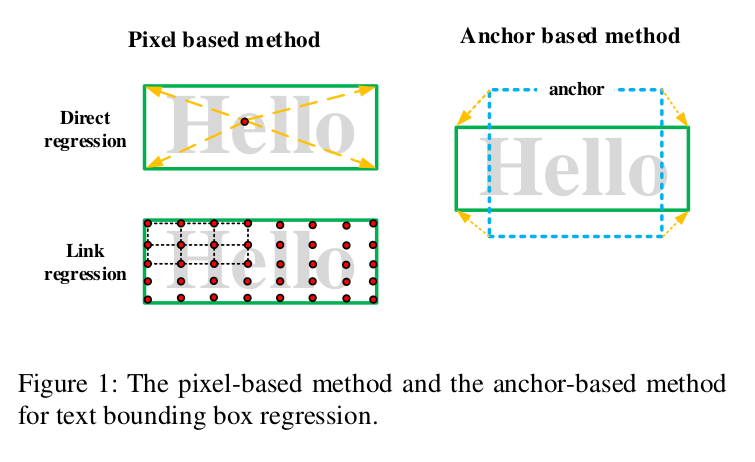

大多数历史最佳方法分为两个类型：来自语义分割的基于像素的方法和来自基于通用对象检测的基于锚的方法。不同的文本元素使用这两种方法检测，它们将相应的边界框回归方法进行组合以获得最终的文本区域，如图1 。不幸的是，在简单应用时，它们都不能满足我们的要求。基于像素的方法有较高的准确率，但由于小文本的像素级特征太稀疏，它的召回率很低。基于锚的方法有较高的召回率，因为anchor-level特征对文本大小不敏感，但是它遇到了“Anchor Matching Dilemma”问题（在第2.2节中描述），并且它没有获得如基于像素方法的高准确率。而且，现有方法在检测跨越图像的长中文文本方面表现不佳。

为了处理这些问题，我们提出一种新颖的端到端可训练的深度神经网络框架，称为Pixel-Anchor，其结合基于像素和基于锚方法的优势。整个框架包含两部分，称为基于像素的模块（pixel-based module）和基于锚（anchor-based module）的模块。这两部分共享从ResNet-50提取的特征。在Pixel-Anchor中，来自pixel-based module的分割热图（heat map）通过anchor-level注意力传入anchor-based module，这提高了anchor-based-method的准确率。在推理阶段，我们进行融合非最大抑制（NMS）[14]以获得最终检测。具体地，我们在anchor-based module中通过锚修剪（trimming）仅保留小而长的锚，同时移除pixel-based模块中小型检测框。最后，我们聚合所有余下的检测框，并进行级联NMS以获得最终的检测结果。Pixel-Anchor的有效性从pixel-based模块和anchor-based模块的共享特征获得。

在pixel-based模块中，我们将FPN和ASPP进行组合以作为语义分割的encoder-decoder结构。通过在 $1/16$ 的特征图上执行ASPP操作来获得大感受野是一种低成本的方式。在anchor-based模块中，我们采用SSD作为基本框架，并提出Adaptive Predictor Layer（APL）来更好地检测在尺寸和宽高比上具有较大变化的场景文本。APL可以有效地调整网络的感受野以适应文本的形状。为了检测跨域图像的长文本线，在APL中，我们进一步提出“long anchor” 和 “anchor density” 。

本文的主要贡献如下：
- 我们提出Pixel-Anchor，一种单发（one-shot）的定向场景文本检测器，其通过特征共享、anchor-level注意力机制和融合NMS结合了基于像素和基于锚的方法的优点。
- 我们为SSD提出APL以更好地检测在尺寸和宽高比上具有较大变化的场景文本。具体地，APL能够有效地检测跨域图像的长文本线。
- 这些特点产生了简单的端到端训练，并改善速度和准确率的平衡。具体地，在较低分辨的输入图像上，我们的方法仍给出了良好的性能。

# 2. Related Works
## 2.1. The pixel-based method
文本的笔画特征是显而易见的，因此很容易从背景中分割文本像素。基于像素的方法直接从文本像素预测文本边界框。

在文本像素分割阶段，每个像素的文本/非文本得分通过典型的encoder-decoder网络预测，这在语义分割任务中被广泛使用。流行的基于像素的方法（EAST、Pixel-Link和PSENet）使用FPN作为encoder-decoder模块。在FPN中，构建了U形结构以维持高分辨率和语义信息。

在文本边界框预测阶段，EAST预测每个正文本像素的文本边界框，然后使用位置感知的NMS以获得最终检测结果。通过在EAST上进行一些小的修改，FOTS在开放数据集上获得非常有竞争力的结果。EAST和FOTS都是高效而准确的，然而，因为它们所处理的文本实例的最大尺寸与网络的感受野是成比例的，EAST和FOTS在检测非常长的文本（如跨越整幅图像的文本）时，表现较差。Pixel-Link和PSENet通过将相邻文本链接在一起而获得文本实例。像素链接方法克服了感受野局限问题，因此它能够检测非常长的文本线。然而，像素链接方法需要复杂的后处理，这很容易受到背景干扰。

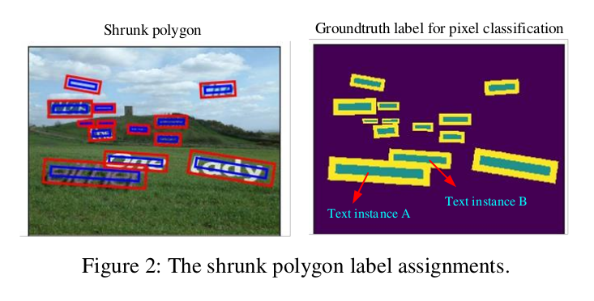

为了提高效率，语义分割方法通常在 $1/4$ 或者甚至更小的特征图上预测前景/背景得分图。为了区分非常接近的文本实例，基于像素的方法通常使用“shrunk polygon（缩小多边形）”来分配ground-truth文本标签，如图2 。通过将文本标签分配到“shrunk polygon”，紧邻的文本实例A和B可以轻松地区分。注意，PSENet使用渐进的尺度缩小多边形来生成ground-truth标签。由于ground-truth标签已经缩小太多，对于基于像素的方法，输入图像必须保持高分辨率以检测小文本并且以相应高的成本及时区分紧密的小文本。

## 2.2. The anchor-based method
锚的概念最初来源于Faster R-CNN，它是两步的通用对象检测框架。首先，它使用锚（先验、默认框）生成提议；接着，描述提议的深度特征通过RoI池化从特征图提取，并且具有深度特征回归对象相对于锚的偏移，而不是直接预测边界框。局域锚的边界框回归在许多流行的检测框架（如YOLO、SSD）中使用。SSD生成特征金塔层次，并且将不同尺度的锚放置于每个特征图，在所有基于锚的方法中，SSD在速度和准确率之间有很好的平衡，并且广泛用于场景文本检测。

Textboxes和Textboxes++修改SSD以检测自然场景文本。Textboxes提出采用SSD网络的三个特殊设计以有效地检测水平场景文本。一是，添加大宽高比的锚以更好匹配文本框的形状，具体地，设置锚的纵横比为1、2、3、5、7 和 10 。二是，通过在垂直方向偏移锚来增加锚的密度，从而检测密集文本。三是，采用 $1\times5$ 卷积滤波器而不是标准的 $3 \times 3$ 的滤波器，$1 \times 5$ 的卷积滤波器可以产生矩形感受野，其更好地适应较大纵横比。基于Textboxes，Textboxes++将默认框的纵横比增加到1、2、3、5、5、 $1/2$ 、 $1/3$ 、 $1/5$ ，以及使用 $3\times5$ 卷积滤波器。

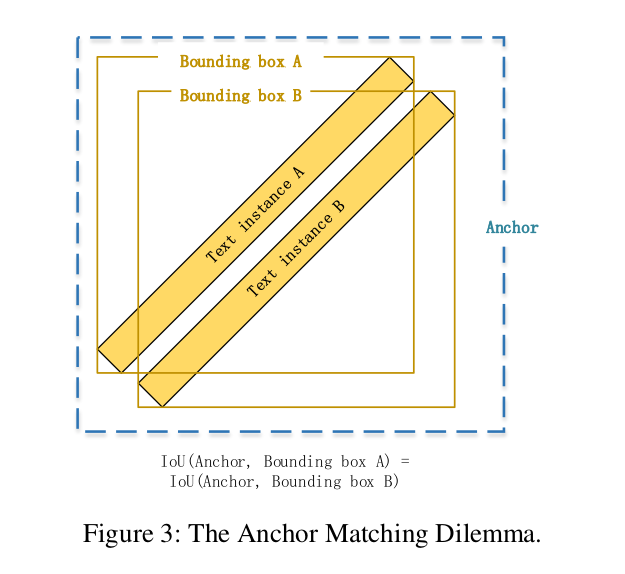

Textboxes++在公开数据集上获得较好的性能，但是他没能成功地处理密集和大角度（large-angle）的文本。Textboxes++使用水平矩形作为锚，对于两种紧邻的大角度文本实例，它很难确定哪个文本实例应该匹配锚。我们称这种现象为“Anchor Matching Dilemma”，如图3所示。这种现象妨碍网络在检测密集大角度文本的表现。

为了克服上述问题，DMPNet和RRPN使用具有不同方向的四边形锚来检测定向文本。然而，它极大地增加了锚的数量。在这种方法中，计算任意两个四边形的交集的面积是耗时的，特别是当锚的数量很大（十万个数量级时。

除了“Anchor Matching Dilemma”外，Textboxes++也遭遇了感受野限制。 $1\times5$ 或者 $3\times5$ 的卷积滤波器不足以检测跨越图像的文本线，即使将锚的宽高比扩大到 $1:10$ ，它不能匹配宽高比通常为 $1:30$ 的长中文文本。

相比基于像素的方法，基于锚的方法直接学习anchor-level抽象特征来描述文本实例，而不是基于像素方法的笔划特征。anchor-level抽象特征不得不面临更多的变化，因此，它通常具有更多false positive 。但是也来自anchor-level抽象特征，基于锚的方法对文本尺寸更具鲁棒性，并且能有效地检测小文本。根据我们的实验，当使用小图像时，基于锚的方法的召回得分通常比基于像素的方法高。

# 3. Pixel-Anchor
## 3.1. Overall Architecture
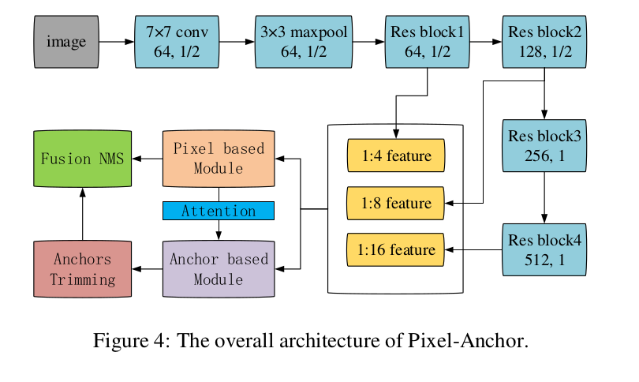
我们的框架概述如图4所示。我们在一个网络中通过特征共享和anchor-level注意力组合了基于像素的方法和基于锚的方法。ResNet-50用于特征提取器骨干。为了基于像素模块中的语义分割任务，将ResNet-50的输出步长设置为16以进行更密集的特征提取，这是通过将res-block的最后步长操作移除，并使用atrous convolution（rate=2）实现。 $1/4$ 、 $1/8$ 和 $1/16$ 的特征图从ResNet-50骨干提取，并在基于像素的模块和基于锚的模块中共享。基于像素模块的分割热图根据anchor-level注意力机制被馈入基于锚模块。在推理期间，除了有效的融合NMS之外，不涉及复杂的后处理。

## 3.2. The pixel-based module
大多数基于像素的文本检测器（如EAST和Pixel-Link）使用FPN作为encoder-decoder模块。为了增加网络的感受野，我们将FPN和ASPP结合作为encoder-decoder结构，并修改ASSP的膨胀率为 $\{3,6,9,12,15,18\}$ （DeepLabv3+中为 $\{6,12,18\}$ ）以获得更精细的感受野。在解码阶段，编码器的特征首先使用双线性上采样两倍，然后与相应的来自网络骨干的低层特征联结（concat）。解码的特征图保留了高空间分辨率和语义信息。pixel-based模块的概况如图5所示。

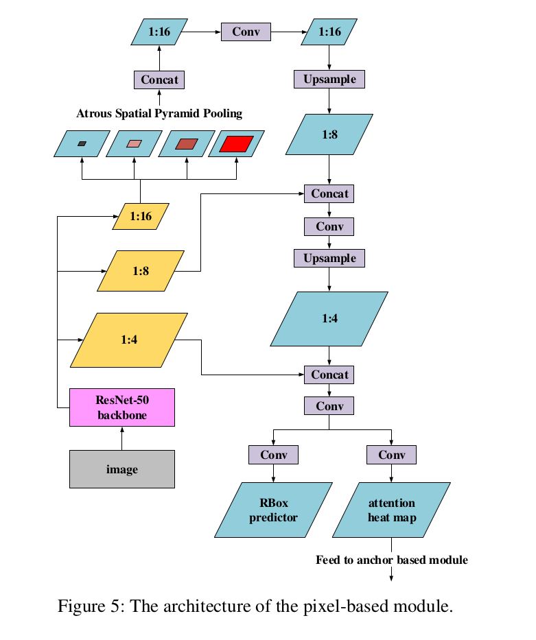

相比FPN模块，ASPP操作更加简单和更加有效。这是增加网络感受野的底层本方式，因为它的多数操作都是在 $1/16$ 的特征图上进行。因此，网络拥有更大的感受野，同时保持高效率。

**pixel-based模块的输出由两个部分组成：旋转边界框和注意力热图。旋转边界框（RBox）预测器包含6个通道（与EAST相似）。第一个通道计算每个像素为正类文本的概率，接着4个通道预测该像素到包含该像素的文本边界框顶部、底部、左侧和右侧的距离，并且最后一个通道预测文本边界框的方向。注意力热图包含一个通道，其表明每个像素为正类文本的概率，并将被传入anchor-based模块。***

**对于RBox的预测器，为了区分十分紧邻的文本实例，“缩小多边形（shrunk polygon）”方法用于分配ground-text标签（如FOTS）。仅缩原始文本区域的缩小部分被视为正类文本区域，而边界框和缩小多边形之间的区域被忽略。对于注意力热图，不采用“缩小多边形”方法，并且所有的原始文本区域被视为正类文本区域。**

我们采用在线难样本挖掘（OHEM）来计算像素分类损失。对于每幅图像，选择512个hard negative non-text像素，512个random negative non-text像素和所有的正类文本像素用于分类训练。将在RBox预测器和注意力热图中选择的用于分类训练的像素集合分别表示为 $\Omega_{RBox}$ 和 $\Omega_{heatmap}$ ，像素分类的损失函数如下式：
$$
\begin{alignat}{2}
L_{p_{cls}} = & \frac{1}{|\Omega_{RBox}|} \sum_{i\in \Omega_{RBox}}H(p_i, p_i^\ast) \\
& + \frac{1}{|\Omega_{heatmap}|} \sum_{i\in\Omega_{heatmap}}H(p_i, p_i^\ast)
\end{alignat}  \tag 1
$$
其中 $|\cdot|$ 是集合中正类文本像素数，$H(p_i, p_i^\ast)$ 表示第 $i$ 个像素的预测标签 $p_i$ 和它的ground-truth标签 $p_i^\ast$ 之间的交叉熵损失。

我们也使用OHEM来计算边界框回归损失（与FOTS一样）。每次训练时，我们从每幅图像选择128个hard positive文本像素和128个random positive文本像素。将选择用于文本边界框回归训练的像素集合表示为 $\Omega_{loc}$ ，用于文本边界框回归的损失函数表示为:
$$
L_{p_{loc}} = \frac{1}{N_{pos}} \sum_{i\in\Omega_{loc}} IoU(R_i, R_i^\ast) + \lambda_{\theta}(1-\cos(\theta_i, \theta_i^\ast))  \tag 2
$$
其中，第一项 $IoU(R_i, R_i^\ast)$ 是第 $i$ 个像素的预测文本边界框 $R_i$ 和它的ground-truth $R_i^\ast$ 之间的IoU损失，第二项是预测方向 $\theta_i$ 和ground-truth 方向 $\theta_i^\ast$ 之间的角度损失， $\lambda_{\theta}$ 是IoU损失和角度损失之间的平衡权重，我们的实验中设置为 10 。 $N_{pos}$ 是正类文本像素数。

因此，对于pixel-based模块，它的损失可以表示为：
$$L_{p_{cls}} = L_{p_{cls}} + \alpha_p L_{p_{cls}} \tag 3$$
其中 $\alpha_p$ 为平衡分类损失和位置损失的权重，我们的实验中设置为1.0 。

## 3.3. The anchor-based module
在anchor-based模块中，我们修改SSD框架以检测在尺寸和纵横比上有大变化的场景文本，该模块如图6 。
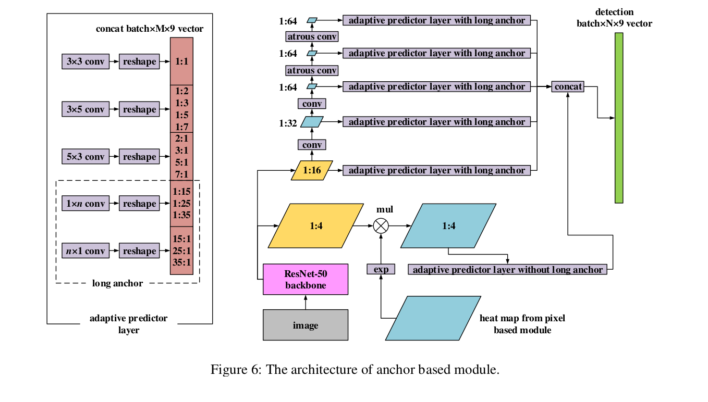

**ResNet-50骨干的 $1/4$ 和 $1/16$ 的特征图与pixel-based模块共享特征。 $1/32$ 、 $1/64$ 、 $1/64$ 、 $1/64$ 的特征图附加在 $1/16$ 的特征图后。这6个特征图表示为 $\{feat1, feat2, feat3 feat4, feat5, feat6\}$ 。为了避免生成很小的特征图，最后两个特征图的分辨率保持不变，并使用相应的atrous卷积（rate=2）。使用 $1/4$ 的特征图而不是SSD中 $1/8$ 特征图，是为了检测小文本。在 $feat1$ 上，应用来自基于像素的模块的注意力热图的注意力监督信息。注意力热图被传入一个指数操作，然后将其与 $feat1$ 点乘。使用指数操作，每个像素为正类文本的概率被映射到[1.0, e] 上，因此，能够保留背景信息，同时突出检测信息。使用这种方式小文本的false positive检测可以减少。**

**此外，我们提出“Adaptive Predictor Layer（APL）”，其附加到每个特征图以获得最终的文本框预测。在APL中，锚根据它们的宽高比分组，并在每个组使用不同的卷积滤波器。具体地，锚被分为如下5个类：**

- **a）正方形锚： aspect ratio = 1:1， 卷积滤波器大小为 $3 \times 3$ 。**
- **b）中型水平锚：aspect ratios = {1:2， 1:3， 1:5， 1:7}，卷积滤波器大小为 $3 \times 5$ 。**
- **c）中型垂直锚：aspect ratios = {2:1， 3:1， 5:1， 7:1}，卷积滤波器大小为 $5\times3$ 。**
- **d）长水平锚： aspect ratios = {1:15， 1:25， 1:35}，卷积滤波器大小为 $1 \times n$ 。**
- **e）长垂直锚： aspect ratios = {15:1， 25:1， 35:1}，卷积滤波器大小为 $n \times 1$ 。**

**对于长锚，在每个特征图上的参数 $n$ 是不同的，并且依赖待检测的文本线的长度。对于 $feat1$ ，我们删除APL中的长锚，并且从 $feat2$ 到 $feat6$ ， $n$ 分别设置为 {33, 29, 15, 15, 15} 。通过使用APL，卷积滤波器的感受野能更好地匹配不同宽高比的单词。**

此外，为了检测密集文本，我们提出 “anchor density”，如图7描述的。

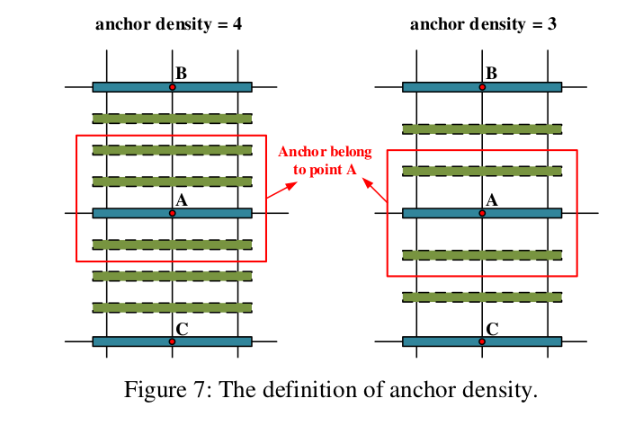

每个锚都基于锚密度的某些偏移进行复制，以更好地覆盖密集文本。在Textboxes++中，锚在垂直方向仅重复一次。**在我们的框架中，正方形锚在水平和垂直方向上重复，水平锚在垂直方向上重复，垂直锚在水平方向上重复。锚的密度在每个特征图上单独指定。在我们的试验中，对于中型锚，$feat1$ 到 $feat6$ 的锚密度为 {1， 2， 3， 4， 3， 2}；对于长锚，从 $feat2$ 到 $feat6$ 的锚密度为 {4， 4， 6， 4， 3} 。**

ground-truth标签的分配策略和anchor-based模块的损失函数与Textboxes++相似。**任意方向的文本表示为四边形，而四边形的最小外接矩形（MBRs: minimum bounding rectangles）用于匹配锚。** 具体地，与ground-truth文本四边形的最大IoU值大于0.5的锚被分配为正类，如果最大IoU值小于0.5，则分配为背景。

anchor-based模块的输出与Textboxes++一样： **每个锚有9个通道的预测向量。** 第一个通道是每个锚为正类文本四边形的概率，而接下来8个通道预测期望的相对于锚的文本四边形坐标偏移。

我们采用OHEM计算分类损失，并设置负类和正类的比例为 $3:1$ 。将选择用于分类训练的锚集（负文本锚和正文本锚）表示Wie $\Omega_a$ ，分类损失表示为：
$$L_{a_{cls}} = \frac{1}{|\Omega_a|}(\sum_{i \in \Omega_a H(p_i, p_i^\ast)}) \tag 4$$
其中 $|\cdot|$ 为集合中正类文本锚的数量， $H(p_i, p_o^\ast)$ 表示第 $i$ 个锚的标签预测 $p_i$ 和它的ground-truth标签 $p_i^\ast$ 之间的交叉熵。

期望的相对于锚的文本四边形坐标偏移的回归损失计算如下：
$$L_{a_{cls}} = \frac{1}{|\Omega_a|}(\sum_{i\in pos(\Omega_a)}SL(l_i, l_i^\ast)) \tag 5$$
其中 $pos(\Omega_a)$ 为 $\Omega_a$ 的正类部分， $SL(l_i, l_i^\ast)$ 表示第 $i$ 个锚的预测坐标偏移 $l_i$ 和ground-truth $l_i^\ast$ 之间的smooth L1损失。

因此，对于anchor-based模块，它的损失可以表示为:
$$L_{a_{dt}} = L_{a_{cls}} + \alpha_a L_{a_{loc}} \tag 6$$
其中 $\alpha_a$ 为平衡分类损失和位置损失你的全红，我们将其设置为0.2以加速收敛。

## 3.4. Training and inference
在训练期间，整个网络使用ADAM优化器端到端训练，而损失函数可定义为：
$$L_{all} = (\alpha_{all}L_{p_{dt}} + L_{a_{pt}}) \tag 7$$
其中 $\alpha_{all}$ 是平衡pixel-based损失和anchor-based损失的权重，我们设置为3.0 。对于数据增强，我们从图像上均匀采样 $640 \times 640$ 的子图以组成大小为32的mini-batch 。模型使用ImageNet预训练。包含800k的合成文本图像 $SynthText$ 用于预训练我们的模型，然后在相应的基准数据集上继续训练过程。对于每个数据集，第一阶段的初始学习率为 0.0001，然后在第二阶段训练减少为 0.00001 。

在推理阶段，我们提出“fusion NMS”来获得最终检测结果。我们分配anchor-based模块检测小文本和长文本，而pixel-based模块检测中型尺寸的文本。在anchor-based的APL中，使用了锚修剪。 **$1/4$ 特征图的所有锚（即3.3节中提到的a、b、c类型）和其他特征图（即3.3节中的d和e类型）上的所有长锚被保留。因为 $1/4$ 特征图（在尺寸上通常较小）上锚通常具有足够的空间来包含两个大角度的文本实例，而长锚仅能匹配小角度的文本实例。“Anchor Matching Dilemma” 可能很少发生。在pixel-based模块中，当预测文本框的MBR（最小外接矩形）的大小小于10个像素，以及其MBR的纵横比不在 $[1:15, 15:1]$ 中时，我们过滤掉这些预测框。最后，我们聚合所有余下的候选文本框，并执行与Textboxes++相似的级联NMS以获得最终检测结果。**  **首先，在预测文本四边形的MBR上应用具有相对高的IOU阈值（例如0.5）的NMS。MBR上的这种操作耗时少得多，并且删除了大多数候选框。然后将文本四边形上具有较低IOU阈值（例如0.2）的耗时NMS应用于的剩余候选框。** 因为pixel-based模块的候选文本框和pixel-based的文本框是重叠的，_我们将1.0加到ancho-based模块预测的文本框的得分中，这些文本框在进行NMS时具有更高的优先级。_

# 4. Experiments
为了获取模型的特征，我们首先使用公共SynthText数据集和我们自己的海报数据集，然后在两个具有挑战性的公共基准上评估我们的方法：ICDAR 2015 [29] and ICDAR 2017 MLT [30] 。

## 4.1. The ability of detecting small scene text
为了强调我们的方法在检测小文本上的性能优于pixel-based方法，我们在SynthText数据集上进行实验。在训练和推理期间，图像的分辨率调整到 $384\times384$， 保留高宽比并填充短边。我们随机选择4000张图像作为验证集，并比较Pixel-Anchor、pixel-based方法和anchor-based方法，结果如表1 ，图8为两种方法的检测的细节。

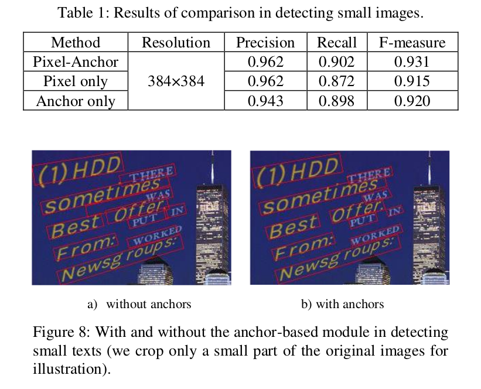

## 4.2. The ability of detecting dense large-angle texts
我们比较了在检测密集大角度文本上Pixel-Anchor和anchor-based方法性能，如图9 。

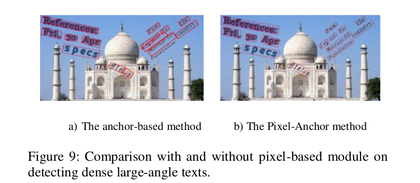

## 4.3. The ability of detecting long text lines
为了强调我们提出的APL能有效地检测长文本线，我们使用我们的poster数据集测设Pixel-Anchor，其包含大量跨域图像的长中文文本线。我们收集和标签了5000张poster图像，选择4000张图像作为训练集，1000张图像作为验证集。在poster数据集上，我们针对 $768 \times 768$ 分辨率的图像上获得0.88的F-measure 。如图10 。

## 4.4. Evaluation on the public datasets
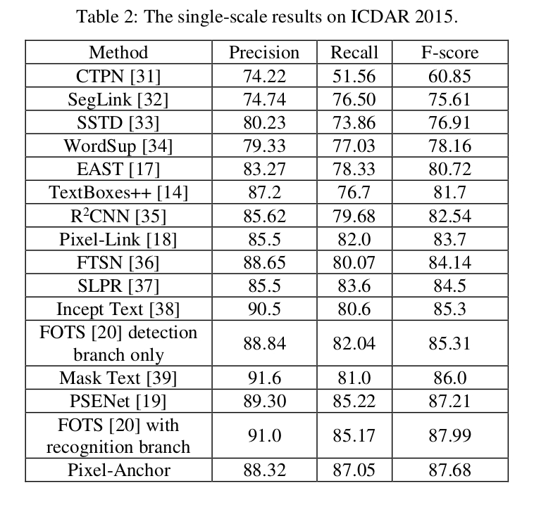

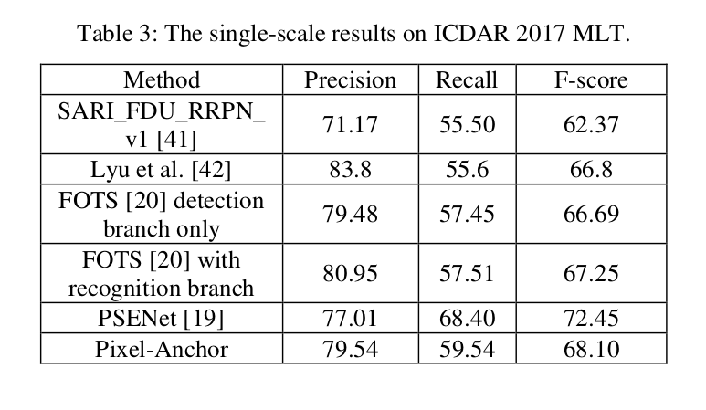
