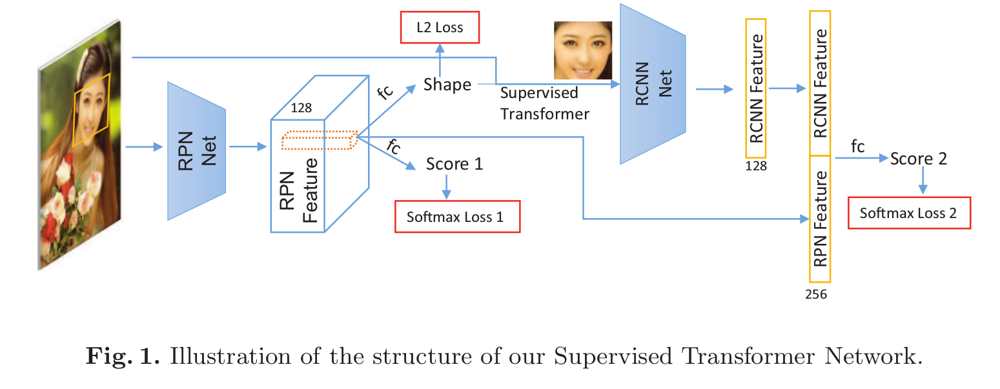
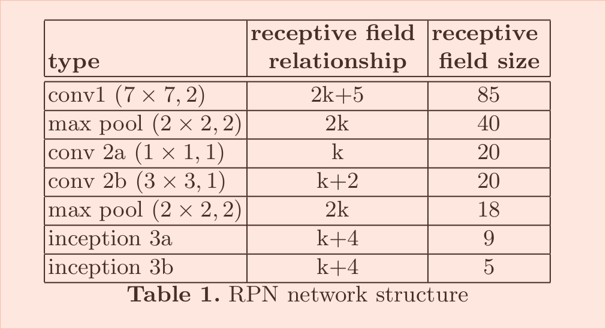
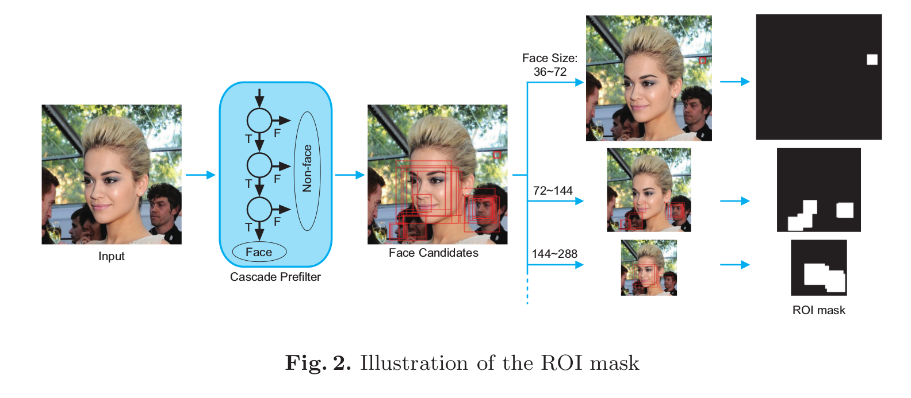
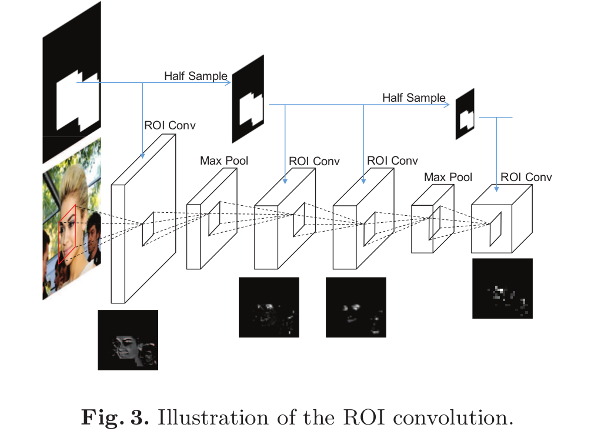

Supervised Transformer Network for Efficient Face Detection
=

# 1 Introduction
在面对现实人脸检测的各种因素中，大的姿态变化仍然是一个很大的挑战。例如，影响重大的 Viola-Jones [1]检测器在近额面部效果良好，但在远离额视图的姿势中，由于非额面部的 Haar 特征较弱，其效果要差得多。

在 Viola-Jones [1]提倡的推进级联体制下，有大量的工作试图解决大姿态变化的问题。它们多采用分而治之（divide-and-conquer）的策略来构建多视角人脸检测器。一些工作[2-4]提出为每个视角训练级联检测器，并且在测试时结合所有检测器的结果。一些其他工作[5-7]提出首先估计人脸姿态，然后对相应的人脸姿态进行级联以验证检测结果。前一个方法的复杂度随姿态类型的数量增加而增加，而后一个检测器的准确率容易出现姿态估计的错误。

基于组件的模型提供了一种替代解决方案[8-10]。这些检测器是灵活的，并且对于姿态变化和部分遮挡是鲁邦的，这是因为它们可以基于一些可行组件检测来可靠地检测人脸。然而，这些方法始终要求目标人脸较大且清楚，这对于可靠地建模组件至关重要。

其他工作通过使用比 Harr wevelet 复杂的不变特征（例如HOG、SIFT、多通道特征和高级 CNN 特征）来处理这个问题。处理这些基于模型的方法，Shen等[13]提出了一种基于样本的图像检索人脸检测方法，该方法实现了最先进的检测精度。

最近几年已被证明，使用 DNN 端到端训练的人脸检测器可以明显优于先前的方法。但是，为了有效处理不同的变化，特别是姿态变化，长要求 DNN 具有非常多的参数，也包含了高计算成本。为了解决这一矛盾的挑战，Li等人[15]提出了一种多分辨率级联DNN体系结构。它在低分辨率阶段快速拒绝背景区域，并在高分辨率阶段仔细评估挑战性的候选。

然而， Li等[15]的一组 DNN 是依次训练的，而不是端到端的，这可能不是我们所期望的。相比之下，我们提出一种新的端到端训练的级联卷积神经网络。第一阶段是多任务的 RPN ，它同时提议候选人脸区域及其相应的人脸 landmark 。受 chen等[16]的启发，由于人脸对齐有助于区分人脸/非人脸，我们联合执行人脸检测和人脸对齐。

不同于 Li 等[15]，该网络在原始分辨率上进行计算以更好地利用更多的辨别性信息。对齐步骤将每个候选人脸区域扭曲成一个标准姿态，该姿态将人脸地标映射到一组标准位置。然后，对齐的候选人脸区域被传入第二个极端的网络——RCNN——以进一步验证。注意，我们只保留 RPN 中局部邻域响应最高的 $K$ 个人脸候选区域。换句话说，那些非前 $K$ 的区域被抑制。这有助于提高检测召回率。

受之前[18]工作的启发，揭示了不同空间分辨率或尺度下的联合特征会提高精度。我们将两个级联网络的特征图连接在一起以形成一个端到端训练的骨干，如图 1 所示。注意，在学习过程中，我们将一组标准位置视为参数，其在端到端的过程中学习。

注意，对齐后的人脸图像中人脸标志的标准位置与候选人脸区域中预测的人脸标志的标准位置共同定义了候选人脸区域的变换。在段导弹的训练过程中，第一阶段 RPN 的人脸标志预测训练也由每个真实人脸区域的标注的人脸标志进行监督。因此，我们称该网络为 Supervised Transformer Network 。这两个特征使我们的模型有别于 Spatial Transformer Network[19]，因为a）Spatial Transformer Network 直接在变换参数上执行回归，以及b）仅通过最终的识别目标监督。

所提出的 Supervised Transformer Network 可以在 GPU 上高效的运行。然而，事实上，CPU 仍仅是多数情况的选择。因此，我们提出 RoI 卷积方案来是 Supervised Transformer Network 的运行时间更加高效。它首先通过一组卷积提升级联来获得一组人脸候选区域。然后，将这些区域组合成不规则的二值 RoI 掩模。所有的 DNN 操作（包括卷积、ReLU、池化和联结）都在 RoI 掩模中处理，因此显著减小计算。

我们的贡献为：1）我们提出新的端到端训练的级联网络（Supervised Transformer Network）用于有效的人脸检测；2）我们引入 Supervised Transformer Layer，其确保学习最优的标准姿态以最好地区分人脸/非人脸模式；3）我们引入 Non-top K Suppression 方案，其能够获得更好的召回率，而步牺牲准确率；4）我们引入 RoI 卷积方案，它在CPU上加速了我们的检测器3倍的速度，而召回率几乎没有下降。

在我们评估的几个公共基准测试中，我们的人脸检测器在实时性能方面超过了当前表现最好的算法，在VGA分辨率下，实时性能达到每秒30帧。

# 2 Network Architecture
## 2.1 Overview
本节中，我们介绍所提出的级联网络的架构。如图 1 所示，整个网络由两个阶段组成。第一个阶段为多任务的 RPN ，它产生一组候选人脸区域以及相应的人脸标志。我们执行 Non-top K Suppression 以仅保留局部邻域中响应排名前 K 个候选人脸区域。

第二阶段以 Supervised Transformer Layer 开始，然后使用一个 RCNN 判断人脸区域是否为真。Transformer 层使用人脸标志和候选人脸区域，然后通过将检测到的人脸标志映射到一组标准位置来将人脸区域扭曲到标准姿态。根据人脸点，显示地消除了旋转和尺度变化的影响。

为了说明这一点，几何变换是由人脸标志和标准位置唯一决定的。我的级联网络中共，人脸标志和标准位置的预测都是在端到端过程学习。我们称之为 Supervised Transformer Layer ，因为它接收两个方面测监督。一方面，人脸标志预测模型的学习通过标注的 ground-truth 人脸标志监督。另一方面，标准位置和人脸标志预测模型的学习是通过最终的分类目标监督。

为了进行最终的决策，我们串联第二阶段 RCNN 网络的细粒度特征和第一阶段的 RPN 网络的全局特征。串联后的特征被输入全连接层以作出最终的人脸/非人脸仲裁。这就总结了我们提出的级联网络的整个架构。

## 2.2 Multi-task RPN
多任务的 RPN 的设计受 JDA 检测器[16]的启发，其验证额人脸对齐有助于区分人脸/非人脸。我们的方法非常直接明了。我们使用 RPN 同时检测人脸及其关联的人脸标志。我们的方法与[20]的工作相似，除了我们的回归目标是人脸标志位置，而非边界框参数。

## 2.3 The supervised transformer layer
本节中，我们描述 Supervised Transformer Layer 的细节。据我们所知，相似的变换广泛用于人脸检测和人脸识别任务以消除尺度和旋转变化。通常的做法是训练一个预测模型来检测人脸标志，然后通过将人脸标志映射到一组人工指定的标准位置，将人脸图像扭曲到一个标准位姿。

这一过程至少有两个缺点：1）一是需要手工设置标准位置。由于标准位置确定修正人脸图像的尺度和偏移，所以它通常采用多次试错（try-and-error）来发现相对较好的设置。这不仅耗费时间，而且是次优的。2）用于人脸标志的预测模型的学习通过 ground-truth 人脸标志点监督，然而，标注 ground-truth 人脸标志是一个高度主观的过程，因此容易引入噪声。

我们提出网络端到端地学习人脸标志的标准位置和预测，其监督信息是利用端到端反向从传播 RCNN 分类目标中获取。具体而言，我们使用如下公式来定义一个相似变换，即：

$$
\left[
\begin{array}{c}
\bar{x}_i - m_{\bar{x}} \\
\bar{y}_i - m_{\bar{y}}
\end{array}
\right]
=
\left[
\begin{array}{2}
a & b  \\
-b & a
\end{array}
\right]
\left[
\begin{array}{c}
x_i - m_x  \\
y_i - m_y
\end{array}
\right]  \tag 1
$$

其中 $x_i, y_i$ 为检测到的人脸标志，$\bar{x}_i, \bar{y}_i$ 为标准位置， $m_\ast$ 为相应变脸的平均值，例如 $m_x = \frac{1}{N} \sum x_i$ ，$N$ 为人脸标志的数量，$a$ 和 $b$ 为相似变换的参数。

我们发现这两参数模型与传统的四参数模型等价，但是在推导上更加简单，并且避免数值计算问题。在一些简单的数学推导后，我们可以得到参数的最小二乘解，即：

$$
\begin{align}
a = \frac{c_1}{c_3} \\
b = \frac{c_2}{c_3}
\end{align}  \tag 2
$$

其中

$$
\begin{alignat}{2}
c_1 &= \sum ((\bar{x}_i - m_{\bar{x}})(x_i - m_x) + (\bar{y}_i - m_{\bar{y}})(y_i - m_y)) \\
c_2 &= \sum ((\bar{x}_i - m_{\bar{x}})(y_i - m_y) - (\bar{y}_i - m_{\bar{y}})(x_i - m_x)) \\
c_3 &= \sum ((x_i - m_x)^2 + (y_i - m_y)^2)
\end{alignat} \tag 3
$$

在获得相似变换参数后，使用 $\bar{I}(\bar{x}, \bar{y}) = I(x,y)$ ，能够获得给定原始图像 $I$ 的修正图像 $\bar I$ 。修正图像中的每个点 $(\bar{x}, \bar{y})$ 可映射回原始图像空间 $(x,y)$ ：

$$
\begin{align}
x = \frac{a}{a^2 + b^2}(\bar{x} - m_{\bar{x}}) - \frac{b}{a^2 + b^2}(\bar{y} - m_{\bar{y}}) + m_x  \\
x = \frac{a}{a^2 + b^2}(\bar{x} - m_{\bar{x}}) - \frac{b}{a^2 + b^2}(\bar{y} + m_{\bar{y}}) + m_y
\end{align}
$$

由于 $x$ 和 $y$ 可能不是整数，所以始终使用双线性插值获得 $I(x,y)$ 的值。因此，我们可以通过链式法则来计算导数：

$$
\begin{alignat}{2}
\frac{\partial{L}}{\partial{a}} &= \sum_{\{\bar{x}, \bar{y}\}} \frac{\partial{L}}{\partial \bar{I}(\bar{x}, \bar{y})} \frac{\partial \bar{I}(\bar{x}, \bar{y})}{\partial a} \\
&=\sum_{\{\bar{x}, \bar{y}\}} \frac{\partial{L}}{\partial \bar{I}(\bar{x}, \bar{y})} \frac{\partial I(x, y)}{\partial a} \\
&= \sum_{\{\bar{x}, \bar{y}\}}\frac{\partial{L}}{\partial \bar{I}(\bar{x}, \bar{y})} \left(\frac{\partial I(x,y)}{\partial x} \frac{\partial\ x}{\partial a} + \frac{\partial I(x,y)}{\partial y} \frac{\partial y}{\partial a}\right)  \\
&=\sum_{\{\bar{x}, \bar{y}\}}\frac{\partial{L}}{\partial \bar{I}(\bar{x}, \bar{y})} \left(I_x \frac{\partial\ x}{\partial a} + I_y \frac{\partial y}{\partial a}\right)
\end{alignat} \tag 5
$$

其中 $L$ 为最终的分类损失，而 $\frac{\partial L}{\partial \bar{I}(\bar{x}, \bar{y})}$ 为 RCNN 网络的反向传播的梯度信号。$I_x$ 和 $I_y$ 为原始图像的水平和垂直梯度：

$$
\begin{align}
I_x = \beta_y(I(x_r,y_b) - I(x_l,y_b)) + (1 - \beta_y)(I(x_r,y_t) - I(x_l,y_t))  \\
I_y = \beta_x(I(x_r,y_b) - I(x_r,y_y)) + (1 - \beta_x)(I(l_r,y_b) - I(x_l,y_t))
\end{align} \tag 6
$$

这里，我们使用双线性插值，$\beta_x = x - \lfloor x \rfloor$ 和 $\beta_y = y - \lfloor y \rfloor$ 。$x_l = \lfloor x \rfloor$ 、$x_r = x_l + 1$ 、$y_t = \lfloor y \rfloor$ 和 $y_b = y_t + 1$ 为点 $(x,y)$ 的左右上下整数边界。相似地，我们可以获得其他参数的导数。最终，我们获得人脸标志的标准位置的梯度，即 $\frac{\partial L}{\partial \bar{x}_i}$ 和 $\frac{\partial L}{\partial \bar{y}_i}$ 。并且与检测大的人脸标志对应的梯度为 $\frac{\partial L}{\partial x_i}$ 和 $\frac{\partial L}{\partial y_i}$ 。更多细节参见补充材料。

我们所提出的 Supervised Transformer Layer 放置在 RPN 和 RCNN 之间。端到端的训练中，它自动调整标准位置，并引导人脸标志的检测使得修正的图像更适合人脸/非人脸分类。我们将进一步在实验中展示结果。

## 2.4 Non-top K suppression
基于 RCNN 的对象检测器中，在区域提议之后，为了效率，非极大值抑制始终用于减小区域候选数量。然而，最高置信度得分的候选可能被后一阶段的 RCNN 拒绝。减小 NMS 的重叠阈值将带来大量无效候选。这将使后续的 RCNN 很慢。我们的想法是保留 K 个候选区域对于每个潜在的人脸都有最高的置信度，因为这些样本对于 RCNN 分类器来说更有前途。在实验部分，我们证明使用所提出的 Non-top K Suppression 可以有效提高召回率。

## 2.5 Multi-granularity feature combination
一些工作反映不同空间分辨率或尺度的联合特征将提高准确率[18]。多数直接方式可能结合不同输入尺度的几个 RCNN 网络。然而，这种方法明显提高计算复杂度。

我们的端到端网络中，RPN 网络结构的细节如图 1 所示。我们的 RPN 网络中有 3 个卷积和 2 个 Inception 层。因此，我们计算出的感受野大小为 85 。而目标人脸的大小为 $36 \sim 72$ 像素。因此，我们的 RPN 利用人脸区域周围的上下文信息。另一方面，RCNN 网络更加关注人脸内部区域的旋转和尺度变化的细粒度细节。因此，我们在端到端架构中串联这两种特征，其使这两个部分更加互补。实验表明这种联合特征显著提高人脸检测的准确率。此外，所提出的方法也更加有效。

# 3 The RoI convolution
作为一种实用的人脸检测算法，实时性能非常重要。然而，在测试阶段使用基于神经网络的模型所产生的大量计算常常使它们在实际系统中不切实际。这就是为什么当前基于 DNN 的模型严重依赖高端GPU来提高运行时性能的原因。然而，高端 GPU 在商品计算系统中并不常见，所以大多数情况下，我们仍然需要使用 CPU 来运行 DNN 模型。然而，即使使用高度优化代码的高端 CPU ，仍然比在 GPU 上的运行时间慢大约 4 倍。更重要的是，对于便携式设备，例如手机和平板电脑，仅有低端 CPU ，有必要加速 DNN 测试阶段的性能。

典型的 DNN 中，卷积的计算成本是最高的层，并且在运行时间通常需要花费 90% 的时间。一些工作也尝试减小卷积层的计算复杂度。例如，Jaderberg 等[22]将稀疏分解应用于重建卷积滤波器。其他一些研究[23,24]假设卷积滤波器在一定维度上近似为低秩的，可以近似分解为一系列较小的滤波器。我们的检测器也收益与这些模型压缩技术。

尽管如此，我们提出更实用的方法来加速我们所提出的 Supervised Transformer Network 用于人脸检测的运行时速度。我们的主要想法是，使用基于卷积级联的人脸检测器来快速拒绝非人脸区域，并获得 _binary RoI mask_ 。RoI 掩模与输入有相同的大小。背景区域用 0 表示，而人脸区域用 1 表示。DNN 卷积仅计算标记为 1 的区域，而忽略所有其他区域。因为区域不参与计算，所以我们可以极大地减小卷积层的计算量。

我们想要强调我们的方法不同于那些基于 RCNN 的算法[17,25]，其独立地对待每个候选区域。在这些方法中，重叠子区域的特征将被重复计算。相反，我们使用 RoI 掩模，使得不同的样本可以共享重叠区域的特征。通过进一步避免重复操作，有效降低了计算成本。与此同时，在下一节中，我们将介绍我们的 RoI 卷积的细节。与 Caffei 相似，我们也利用 BLAS 库中的矩阵乘法以获得几乎线性加速。

## 3.2 Implementation details

**Cascade pre-filter.** 如图 2 所示，我们使用级联检测器用于 pre-filter 。它基本上是 Volia-Jones 检测器[1]的变体，但是具有更弱的分类器，并使用更多数据训练。我们的提升分类器由 1000 个弱分类其组成。与[1]不同，我们采用提升 fern[27]作为较弱的分类器，因为 fern 比单个基于Haar特征的决策桩更强大，在 CPU 上比提升树更高效。为了完整起见，我们简要描述了我们的实现。

每个 fern 包含 8 个二值节点。分割函数是将两个图像像素值在两个不同位置的差值与阈值进行比较，即：

$$
s_i = \begin{cases}
1 & p(x_{1i}, y_{1i}) - p(x_{2i}, y_{2i}) < \theta_i \\
0 &\mbox{ otherwise}
\end{cases} \tag 7
$$

其中 $p$ 为图像块。块大小固定为 32 。$(x_{1i}, y_{1i}, x_{2i}, y_{2i}, \theta_i)$ 为由训练数据学习的 fern 参数。每个 fern 将数据空间分割为 $2^8 = 256$ 个分区。我们使用 Real-Boost 算法以进行级联分类学习。每个空间分割中，分类得分计算为：

$$\frac{1}{2} \left(\frac{\sum_{\{i\in piece \cap y_i = 1\}} w_i}{\sum_{\{i\in piece \cap y_i = 0\}} w_i}\right)  \tag 8$$

其中分子和分母分别为空间划分中正样本和负样本的权值之和。

**The RoI mask.** 在获得一些候选区域之后，我们根据它们的尺寸分组。每个组中，最大尺寸是最小尺寸的两倍。由于通过所提出的基于 DNN 的人脸检测器所检测的最小人脸尺寸为 $36 \times 36$ 像素，所以第一个分组包含的人脸尺寸为 36 到 72 个像素，而第二阶段包含的人脸尺寸为 72 到 144 等等（如图2）。

应当注意的是，从第二组开始，我们需要下采样图像，使得图像中候选人脸的大小始终维持在 36 到 72 像素。此外，为了保留一些背景信息，我们将加倍每个候选边的长度。但是边的长度不会超过接下来的 DNN 人脸检测器的感受野大小（85）。最终，我们根据每组中候选边界框的大小和位置来设置 RoI 掩模。

我们使用这种分组策略有两个原因。第一，当存在人脸几乎填充整个图像时，我们不得不处理完整原始图像大小。相反，它将被降采样到一个相当小的分辨率，这样我们可以更有效地降低计算成本。第二，由于后面的 DNN检测器仅需要处理尺度变化两次，所以在与 RPN 进行对比时，有极大的好处。这种优势运行我们使用相对便宜的网络进行基于 DNN 的检测。

此外，与基本尺度相比，如此稀疏的金字塔结构仅增加大约 33% （$\frac{1}{1^2} + \frac{1}{4^2} + \frac{1}{8^2} \cdots \approx \frac{1}{3}$） 计算成本。

**Details of the RoI convolution.** 存在几种有效实现卷积的几种方式。最近，最流行的方法是将卷积转换为矩阵乘法。如[28]所述，并在 Caffe[26] 中实现，这可通过首先见滤波器张量调整为维度为 $CK^2 \times N$ 的矩阵 $F$ 来实现，其中 $C$ 和 $N$ 为输入和输出的通道数，而 $K$ 为滤波器的宽/高。

随后，我们通过将原始输入数据复制到维度为 $WH \times CK^2$ 的矩阵 $D$ 来聚合数据矩阵，其中 $W$ 和 $H$ 分别为输出的高度和维度。然后，使用矩阵乘法执行计算以形成维度为 $WH \times N$ 的输出矩阵 $O=DF$ 。这种矩阵乘法可以通过优化的线性代数库（如BLAS）高效计算。

RoI 卷积测主要思想是仅计算标记为 1 的区域（即，RoI 区域），同时提高其他区域。根据 RoI 掩模，我们仅复制中心标记为 1 的输入块（patch）。 因此，输入数据变为维度为 $M \times CK^2$ 的矩阵 $D'$，其中 $M$ 为 RoI 中非零条目的数量。相似地，然后，我们使用矩阵乘法获得维度为 $M \times CK^2$ 的输出 $O' = D'F$ 。最后，我们将 $O'$ 的每行放置到输出的相应通道。RoI 的计算复杂度为 $MCK^2N$ 。因此，我们根据掩模的稀疏程度线性减小计算成本。

如图 3 所示，我们仅将 RoI 卷积用于测试阶段。我们将所有的卷积层替换为 RoI 卷积。在最大池化之后，输入的尺寸减半。因此，我们也半采样 RoI 掩模，使得它们的大小可以匹配。对于VGA图像，原DNN检测器在GPU上可以运行 50 FPS，在CPU上可以运行 10 FPS 。利用 RoI 卷积，在少量的准确率损失的情况下，将 CUP 的计算速度提高到 30 FPS 。

# 4 Experiments
