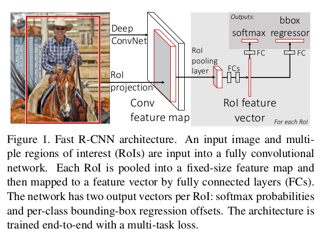
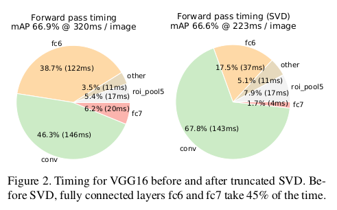

Fast R-CNN
=

# 1 Introduction
检测任务的两个挑战：一是必须生成大量的候选目标位置（称为“提议”），二是这些候选仅能提供粗糙的位置，必须通过精调以获得精确定位。

## 1.1 R-CNN and SPPnet
R-CNN的缺点：
1. **Training is a multi-stage pipline.** -CNN首先使用对数损失对对象提案进行卷积网络微调。然后，用SVM拟合卷积特征。SVM扮演对象检测器，替换softmax分类器。最后，学习一个bounding-box回归器。

2. **Training is expensive in space and time.** 对于SVM和边界框回归训练，从每个图像中的每个对象提议中提取特征并需将其写入磁盘。

3. **Object detection is slow.** 在测试期间，特征从每幅测试图像的每个对象提议提取。

R-CNN很慢是因为它为每个对象提议执行卷积前向传播，没有共享计算。SPPnet通过共享计算获得加速。

SPPnet也有明显的缺点：与R-CNN相似，训练都是多阶段的，包括提取特征、使用对数损失微调网络、训练SVM以及最终的拟合边界框回归器。特征同样被写入硬盘。但与R-CNN不同，SPPnet中提出的微调算法无法更新空间金字塔池之前的卷积层。不出所料，这种限制（固定卷积层）限制了非常深的网络的准确性。

## 1.2 Contributions
1. 比R-CNN、SPPnet更高的检测质量（mAP）；
2. 训练是single-stage，并使用多任务损失；
3. 训练可以更新所有网络层；
4. 无需为特征缓存提供硬盘存储。

# 2 Fast R-CNN architecture and training

图1显示了Fast R-CNN的架构，Fast R-CNN将整个图像和对象提议集合作为输入。首先，图像经过几个卷积层和最大池化层产生卷积特征图。然后，对于每个对象提议，RoI层从特征图上提取固定长度的特征。最后，每个特征向量被传入后续的全连接层，最终分支到两个兄弟输出层：一个产生softmax概率来估计 $K$ 个类别和一个 “背景” ，另一个为每个K对象类输出4个与坐标位置对应的实数。

## 2.1 The RoI pooling layer
RoI池化层使用最大池化将任何有效感兴趣区域内的特征转换为具有固定空间范围H×W（例如，$7\times7$ ）的小特征图，其中 $H$ 和 $W$ 是与任何特定的RoI无关的超参数。RoI是卷积特征图上的举行窗口，每个RoI定义为4元组 $(r, c, h, w)$ ，指定其左上角 $(r, c)$ 及其高度和宽度 $(h, w)$ ）。   

RoI工作方式是：将 $h \times w$ 的RoI划分到 $H \times W$ 网格的子窗口中，每个子窗口大小约为 $h/H \times w/W$ ， 然后将每个子窗口中的值最大化到相应的输出网格单元中。池化独立地应用到每个特征图通道。RoI是SPP的简化。

## 2.3 Fine-tuning for detection
Fast R-CNN 的一个重要能力是可以通过反向传播训练所有网络权重。然而，SPPnet不能以相同的方式训练，其根本原因是当每个训练样本（即，RoI）来自不同的图像时，通过SPP层的反向传播是非常低效的，这正是R-CNN和SPPnet网络被训练的方式。效率低下的原因在于每个RoI可能具有非常大的感受野，通常跨越整个输入图像。由于前向传播必须处理整个感受野，因此训练输入很大（通常是整个图像）。

Fast R-CNN训练： 随机梯度下降（SGD）小批量分层采样，首先采样 $N$ 个图像，然后从每个图像采样 $R/N$ 个RoI。至关重要的是，在前向和后向传播过程中，来自同一张图像的RoI共享计算和内存。使 $N$ 小可以减少小批量计算。例如，当使用 $N = 2$ 和 $R = 128$ 时，所提出的训练方案比从128个不同图像中采样一个RoI大约快64倍（即，R-CNN和SPPnet策略）。

对该策略的一个担忧是它可能导致缓慢的训练收敛，因为来自相同图像的RoI是相关的。 这个问题似乎不是一个实际问题，我们使用比R-CNN更少的SGD迭代，使用 $N = 2$ 和 $R = 128$ 获得了良好的结果。

Fast R-CNN使用微调简化训练过程，共同优化softmax分类器和边界框回归器，而不是在三个单独的阶段训练softmax分类器，SVM和回归器。

**Multi-task loss.** 联合训练的损失函数为：
$$L(p, u, t^u, v) = L_{cls}(p, u) + \lambda [u \ge 1]L_{loc}(t^u, v)  \tag 1$$

其中 $L_{cls}(p, u) = -\log p_u$ 是真实类别 $u$ 的对数损失。$L_{loc}$ 为位置损失：
$$L_{loc}(t^u, v) = \sum_{i \in {x, y, w, h}}smooth_{L_1}(t_i^u - v_i)   \tag 2$$
其中
$$
smooth_{L_1} =
       \begin{cases}
       0.5 x^2 & \text{if}  |x| < 1   \tag 3\\
       |x| - 0.5 & \text{otherwise}
       \end{cases}
$$

$smooth_{L_1}$ 对异常值的敏感程度低于R-CNN和SPPnet使用的 $L_2$ 损失。当回归目标无界时， $L_2$ 损失的训练需要仔细调整学习率才能阻止梯度爆炸，而式3消除了这种敏感性。

超参数 $\lambda$ 控制两个任务损失之间的平衡。同时规范化ground-truth回归目标 $v_i$ 到零均值和单位方差。试验中，使用 $\lambda = 1$ 。

**Mini-batch sampling.** 在微调阶段，每个SGD mini-batch有 $N = 2$ 张图像构成。$R=128$ ，即从每张图像采用64个RoI。与ground-truth的IoU大于0.5的RoI视为前景对象，即 $u \ge 1$ 。剩下的与ground-truth的IoU在区间 $[0.1, 0.5)$ 的RoI视为背景，即 $u = 0$ 。IoU小于0.1的提议忽略。在训练期间，图像以0.5的概率水平翻转。不再使用其他数据增强方法。

**Back-propagation through RoI pooling layers.** 令 $x_i \in \Bbb{R}$ 输入到RoI池化层的为第 $i$ 个激活，令 $y_{rj}$ 为来自第 $r$ 个RoI的第 $j$ 个输出。RoI池化计算为 $y_{rj} = x_{ i^* (r, j)}$, 其中 $i^* (r, j) = argmax_{i' \in \cal{R}(r, j)}x_{i'}$ 。 $\cal{R}(r, j)$ 是子窗口中的输入索引集合，该子窗口中输出单元 $y_{rj}$ 的最大池化。 单个的 $x_i$ 可能分配给几个不同的输出 $y_{rj}$ 。

RoI层的反向函数计算相应输入变量 $x_i$ 的偏导：
$$\frac {\partial L} {\partial x_i} = \sum_r \sum_j [i = i^* (r, j)]\frac{\partial L}{partial y_{rj}}  \tag 4$$

**SGD hyper-parameters.** 全连接层用于softmax分类和边界框回归，它们均值为0，方差分别为0.01和0.001初始化，偏差初始化为0。所有层中，每层权重的学习率为1，偏差的学习率为2，全局学习率为0.001。在VOC07或VOC12 trainval数据集上使用SGD训练30k mini-batch迭代后，将学习率降低为0.0001，并训练10k。weight_decay = 0.0005，momentum = 0.9。

## 2.4 Scale invariance
获取尺度不变对象检测的两种方式：（1）通过“蛮力（brute force）”学，（2）使用图像金字塔。蛮力学习是在训练和测试时，使用一个预定义的像素尺寸处理每幅图像。网络必须从训练数据中学习尺度不变的对象检测。

相反，多尺度方法通过图像金字塔提供对网络的近似尺度不变性。在测试时，在测试时，图像金字塔用于近似地对每个对象提议进行缩放标准化。在多尺度训练期间，我们在每次采样图像时随机采样金字塔尺度，作为数据增强的一种形式。

# 3 Fast R-CNN detection
在训练期间，网络输入为一幅图像（或者一个图像金字塔，编码成图像列表）和 $R$ 个候选提议的列表。测试时， $R$ 通常大约为2000。对于每个测试RoI $r$，前向传递输出类后验概率分布 $p$ 和一组相对于 $r$ 的预测边界框偏移（每个K类获得其自己的精细边界框预测）。

## 3.1 Truncated SVD for faster detection
对于全图像分类，与conv层相比，计算完全连接层所花费的时间较少。相反，对于检测，需要处理的RoI是巨大的，并且全连接层的计算花费的时间占据了几乎前向传播时间的一半（如图2）。大型全连接层可以通过使用截断（truncated）SVD压缩权重来轻松地加速。

  

在这项技术中，一层被参数化为 $u \times v$ 的权重矩阵 $W$， 其被近似地分解为
$$ W \approx U \sum{_t} V^T  \tag 5$$
其中， $U$ 是包含 $W$ 的前 $t$ 个左奇异向量组成的 $u \times t$ 矩阵， $\sum{_t}$ 是包含 $W$ 前 $t$ 个奇异向量的 $t \times t$ 的对角矩阵， $V$ 是 $W$ 的前 $t$ 个右奇异向量组成的 $u \times t$ 矩阵。截断SVD将参数量从 $uv$ 减少到 $t(u + v)$ 。为了压缩网络，对应于 $W$ 的单个全连接层被两个全连接层代替，它们之间没有非线性。这些层中的第一层使用权重矩阵 $\sum{_t} V^T$（并且没有偏差），第二层使用 $U$（具有与 $W$ 相关联的原始偏差）。
