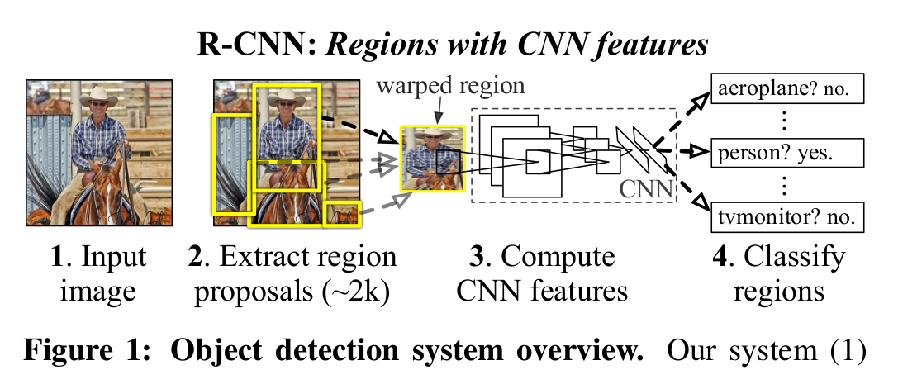

Rich feature hierarchies for accurate object detection and semantic segmentation
=======================================================

# 1. 本文回答的问题
ImageNet的CNN分类结果在多大程度上推广到PASCAL VOC挑战的物体检测结果？ 即如何构建分类和目标检测之间的桥梁? 本文最先显示CNN可以产生比HOG类方法高的多的目标检测性能。本文关注两个问题： 使用深度网络定位目标和仅用少量标注的检测数据训练大容量模型。

本文放弃之前使用滑动窗口进行检测的方案，转而将定位问题通过“recognition using regions”的策略来解决。在测试时，每张输入图像生成大约2000个类别独立的区域提议，并使用CNN从每个提议中提取一个固定长度的特征向量，然后使用类别特定的线性SVM分类每个区域。使用简单的技术（仿射图像变形）来计算来自每个区域提议的固定大小的CNN输入，而不管区域的形状如何。整个流程如图1。

检测面临的第二个挑战是标记数据稀缺，目前可用的数量不足以训练大型CNN。本文使用在大型辅助数据（ILSVRC）进行有监督的预训练，接着在小型数据集（PASCAL）进行域特定的微调，这是一种有效的大容量CNN训练方法。

# 2 Object detection with R-CNN
## 2.1 Model Design

**Region proposals.** 使用选择性搜索（selective search）生成区域。

**Feature extraction.** 使用AlexNet从每个区域提议中提取4096维特征向量。通过向前传播减去通道均值的 $227×227$ RGB图像到五个卷积层和两个全连接的层来计算特征。忽略候选区域的大小或者纵横比，将围绕它的紧密边界框中的所有像素扭曲到所需的大小。   

## 2.2 Test-time detection
使用选择性搜索在测试图像上提取大约200个区域提议。将每个区域进行扭曲变换并前向馈入CNN来计算特征。然后使用SVM为提取的特征向量进行评分。最后，给定图像中的所有评分区域，应用贪婪NMS排除重复区域。

**Rum-time analysis.** 两个属性使检测有效。一是所有CNN参数在所有类别见共享。二是CNN计算出的特征向量与其他方法相比是低维的。GPU：13s/image， CPU： 53s/image。

# 3 Bounding-box regression
在使用类别特定的SVM为每个选择性搜索的提议评分后，使用类别特定的边界框回归器（bounding-box regressor）预测一个新的边界框。与DPM不同之处是，本文使用CNN计算的特征进行回归，而不是根据推断的DPM部件位置计算的几何特征。  

输入训练算法的是 $N$ 个训练对集合 $\{(P^i, G^i)\}_{i=1, ..., N}$ ，其中 $P^i = (P_x^i, P_y^i, P_w^i, P_h^i)$ 是边界框的中心坐标和长宽。因此，可以简单表示ground-truth边界框 $G$ 为： $G = (G_x, G_y, G_w, G_h)$ 。目标是学习一个从提议边界框 $P$ 到ground-truth边界框 $G$ 的变换。参数化变换为四个函数 $d_x(P), d_y(P), d_w(P), d_h(P)$ ，前两个指定 $P$ 的边界框中心的尺度不变的平移，而后两个指定 $P$ 的边界框的宽度和高度的对数空间平移。在学习这个函数后，变换可以由输入的提议 $P$ 预测ground-truth边界框 $\hat{G}$ ：
$$
\begin{align}
\hat{G}_x = P_w d_x(P) + P_x   \tag 1  \\
\hat{G}_y = P_h d_y(P) + P_y   \tag 2  \\
\hat{G}_w = P_w \exp(d_w(P))   \tag 3  \\
\hat{G}_h = P_h \exp(d_h(P))   \tag 4  \\
\end{align}
$$
每个函数 $d_*(P)$ 在提议 $P$ 的第5个池化特征上建立的线性变化函数，用 $\phi_5(P)$ 表示。因此, 有 $d_*(P) = w_*^T \phi_5(P)$ ，其中 $w_*$ 是科学性的模型参数向量。通过优化正则化最小二乘目标（岭回归）来学习 $w_*$ ：
$$w_* = argmin_{\hat{w}_*} \sum_i^N(t_*^i - \hat{w}_*^T \phi_5(P^i))^2 + \lambda ||\hat{w}_*||^2  \tag 5$$
回归目标 $t_*$ 定义为：
$$
\begin{align}
t_x = (G_x - P_x) / P_w   \tag 6  \\
t_y = (G_y - P_y) / P_h   \tag 7  \\
t_w = \log(G_w / P_w)     \tag 8  \\
t_h = \log(G_h / P_h)     \tag 9  \\
\end{align}
$$
